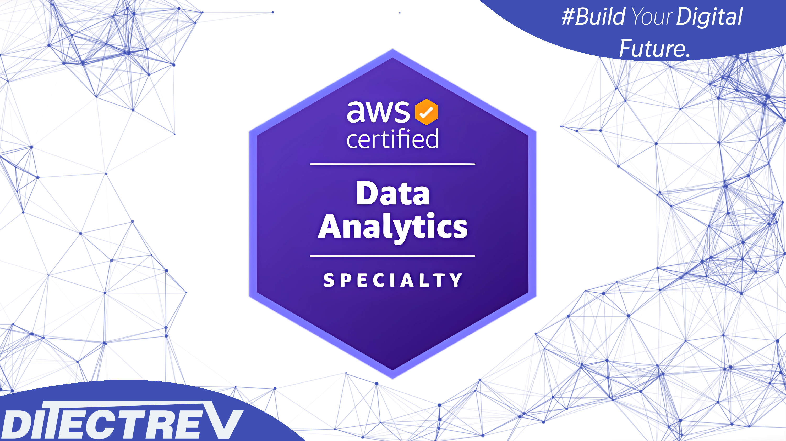

# ⬆️ Amazon Web Services Certified (AWS Certified) Data Analytics Specialty (DAS-C01) Practice Tests Exams Questions & Answers

## Udemy & Etsy

❣️ Please support us by purchasing this course on Udemy in an interactive version with the [discounted link](https://www.udemy.com/course/aws-certified-data-analytics-specialty-das-c01-exams-t/?referralCode=73B22BCE065A00147967). If you're working for a company, you could most probably easily claim this expense during preparation for your exam. For us, it's to be, or not to be, in the game.

🛍️ Alternatively, you can buy the PDF with those questions on [Etsy](https://ditectrev.etsy.com/listing/1566274249).

## ✨ This course is unlike any Amazon Web Services Certified (AWS Certified) Data Analytics Specialty (DAS-C01) course you will find online

✋ Join a live online community and a course taught by industry experts and pass the Amazon Web Services Certified (AWS Certified) Data Analytics Specialty (DAS-C01) confidently. We aim to build an ecosystem of Information Technology (IT) certifications and online courses in cooperation with the technology industry. We believe it will give our students 100% confidence in the pacing market in an open-source environment. We are just at the beginning of our way, so it's even better for you to join now!

## ⌛️ Short and to the point; why should you take the course

1. Always happy to answer your questions on Udemy's Q&A's and outside :)
2. Failed? Please submit a screenshot of your exam result and request a refund (via our upcoming platform, not possible on Udemy); we'll always accept it.
3. Learn about topics, such as:
   - Active Directory;
   - Amazon Athena;
   - Amazon Aurora;
   - Amazon CloudWatch;
   - Amazon DynamoDB;
   - Amazon Elastic Compute Cloud (Amazon EC2);
   - Amazon Elastic Map Reduce (Amazon EMR);
   - Amazon Kinesis;
   - Amazon OpenSearch Service;
   - Amazon QuickSight;
   - Amazon Redshift;
   - Amazon Relational Database Service (Amazon RDS);
   - Amazon Simple Storage Service (Amazon S3);
   - Apache Kafka;
   - Apache Spark;
   - AWS CloudFormation;
   - AWS Command Line Interface (AWS CLI);
   - AWS Glue;
   - AWS Identity and Access Management (AWS IAM);
   - AWS Key Management Service (AWS KMS);
   - AWS Lambda;
   - Extract, Transform, Load (ETL);
   - Hadoop Distributed File System (HDFS);
   - Input/Output operations Per Second (IOPS);
   - Virtual Private Clouds (VPC);
   - **Much More!**
4. Questions are similar to the actual exam, without duplications (like in other courses ;-)).
5. The Practice Tests Exams simulate the actual exam's content, timing, and percentage required to pass the exam.
6. This course is **not** an Amazon Web Services Certified (AWS Certified) Data Analytics Specialty (DAS-C01) Exam Dump. Some people use brain dumps or exam dumps, but that's absurd, which we don't practice.
7. 83 **unique** questions.

## ☝️ Course Updates

**[v1.0.0](../../releases/tag/v1.0.0): September 13, 2023.**

- Launch of the course.

**[v1.0.1](../../releases/tag/v1.0.1): November 1, 2023.**

- Fix all remaining typos with support of automated proofreading software.

**[v1.0.1](../../releases/tag/v1.0.1): August 1, 2024.**

- AI-generated explanations (only paid [Udemy](https://www.udemy.com/course/aws-certified-data-analytics-specialty-das-c01-exams-t/?referralCode=73B22BCE065A00147967)).

## 🙋‍♀️ & 🙋‍♂️ Contribution

We are so thankful for every contribution, which makes sure we can deliver top-notch content. Whenever you find a missing resource, broken link in a [Table of Contents](#table-of-contents), the wrong answer, please submit an [issue](../../issues). Even better would be a [Pull Request (PR)](../../pulls).

## Who this course is for:

- 👨‍🎓 Students preparing for the Amazon Web Services Certified (AWS Certified) Data Analytics Specialty (DAS-C01) Exam;
- 👨‍🎓 Amazon Web Services (AWS) Engineers;
- 👨‍🎓 Business Analysts;
- 👨‍🎓 Data Analysts;
- 👨‍🎓 Data Engineers;
- 👨‍🎓 Data Scientists.

## Requirements

- 🤩 Excitement to learn!
- 0️⃣ Prior knowledge is required;
- ✅ You can pass the Amazon Web Services Certified (AWS Certified) Data Analytics Specialty (DAS-C01) Exam solely based on our Practice Tests Exams.

## Table of Contents

| No. | Questions |
| --- | --------- |
| 1   | [A streaming application is reading data from Amazon Kinesis Data Streams and immediately writing the data to an Amazon S3 bucket every 10 seconds. The application is reading data from hundreds of shards. The batch interval cannot be changed due to a separate requirement. The data is being accessed by Amazon Athena. Users are seeing degradation in query performance as time progresses. Which action can help improve query performance?](#a-streaming-application-is-reading-data-from-amazon-kinesis-data-streams-and-immediately-writing-the-data-to-an-amazon-s3-bucket-every-10-seconds-the-application-is-reading-data-from-hundreds-of-shards-the-batch-interval-cannot-be-changed-due-to-a-separate-requirement-the-data-is-being-accessed-by-amazon-athena-users-are-seeing-degradation-in-query-performance-as-time-progresses-which-action-can-help-improve-query-performance)
| 2   | [A team of data scientists plans to analyze market trend data for their company's new investment strategy. The trend data comes from five different data sources in large volumes. The team wants to utilize Amazon Kinesis to support their use case. The team uses SQL-like queries to analyze trends and wants to send notifications based on certain significant patterns in the trends. Additionally, the data scientists want to save the data to Amazon S3 for archival and historical reprocessing, and use AWS managed services wherever possible. The team wants to implement the lowest-cost solution. Which solution meets these requirements?](#a-team-of-data-scientists-plans-to-analyze-market-trend-data-for-their-companys-new-investment-strategy-the-trend-data-comes-from-five-different-data-sources-in-large-volumes-the-team-wants-to-utilize-amazon-kinesis-to-support-their-use-case-the-team-uses-sql-like-queries-to-analyze-trends-and-wants-to-send-notifications-based-on-certain-significant-patterns-in-the-trends-additionally-the-data-scientists-want-to-save-the-data-to-amazon-s3-for-archival-and-historical-reprocessing-and-use-aws-managed-services-wherever-possible-the-team-wants-to-implement-the-lowest-cost-solution-which-solution-meets-these-requirements)
| 3   | [A large company receives files from external parties in Amazon EC2 throughout the day. At the end of the day, the files are combined into a single file, compressed into a gzip file, and uploaded to Amazon S3. The total size of all the files is close to 100 GB daily. Once the files are uploaded to Amazon S3, an AWS Batch program executes a COPY command to load the files into an Amazon Redshift cluster. Which program modification will accelerate the COPY process?](#a-large-company-receives-files-from-external-parties-in-amazon-ec2-throughout-the-day-at-the-end-of-the-day-the-files-are-combined-into-a-single-file-compressed-into-a-gzip-file-and-uploaded-to-amazon-s3-the-total-size-of-all-the-files-is-close-to-100-gb-daily-once-the-files-are-uploaded-to-amazon-s3-an-aws-batch-program-executes-a-copy-command-to-load-the-files-into-an-amazon-redshift-cluster-which-program-modification-will-accelerate-the-copy-process)
| 4   | [A company has a business unit uploading .csv files to an Amazon S3 bucket. The company's data platform team has set up an AWS Glue crawler to do discovery, and create tables and schemas. An AWS Glue job writes processed data from the created tables to an Amazon Redshift database. The AWS Glue job handles column mapping and creating the Amazon Redshift table appropriately. When the AWS Glue job is rerun for any reason in a day, duplicate records are introduced into the Amazon Redshift table. Which solution will update the Redshift table without duplicates when jobs are rerun?](#a-company-has-a-business-unit-uploading-csv-files-to-an-amazon-s3-bucket-the-companys-data-platform-team-has-set-up-an-aws-glue-crawler-to-do-discovery-and-create-tables-and-schemas-an-aws-glue-job-writes-processed-data-from-the-created-tables-to-an-amazon-redshift-database-the-aws-glue-job-handles-column-mapping-and-creating-the-amazon-redshift-table-appropriately-when-the-aws-glue-job-is-rerun-for-any-reason-in-a-day-duplicate-records-are-introduced-into-the-amazon-redshift-table-which-solution-will-update-the-redshift-table-without-duplicates-when-jobs-are-rerun)
| 5   | [An airline has .csv-formatted data stored in Amazon S3 with an AWS Glue Data Catalog. Data analysts want to join this data with call center data stored in Amazon Redshift as part of a dally batch process. The Amazon Redshift cluster is already under a heavy load. The solution must be managed, serverless, well-functioning, and minimize the load on the existing Amazon Redshift cluster. The solution should also require minimal effort and development activity. Which solution meets these requirements?](#an-airline-has-csv-formatted-data-stored-in-amazon-s3-with-an-aws-glue-data-catalog-data-analysts-want-to-join-this-data-with-call-center-data-stored-in-amazon-redshift-as-part-of-a-dally-batch-process-the-amazon-redshift-cluster-is-already-under-a-heavy-load-the-solution-must-be-managed-serverless-well-functioning-and-minimize-the-load-on-the-existing-amazon-redshift-cluster-the-solution-should-also-require-minimal-effort-and-development-activity-which-solution-meets-these-requirements)
| 6   | [A large ride-sharing company has thousands of drivers globally serving millions of unique customers every day. The company has decided to migrate an existing data mart to Amazon Redshift. The existing schema includes the following tables. A trips fact table for information on completed rides. A drivers dimension table for driver profiles. A customers fact table holding customer profile information. The company analyzes trip details by date and destination to examine profitability by region. The drivers data rarely changes. The customers data frequently changes. What table design provides optimal query performance?](#a-large-ride-sharing-company-has-thousands-of-drivers-globally-serving-millions-of-unique-customers-every-day-the-company-has-decided-to-migrate-an-existing-data-mart-to-amazon-redshift-the-existing-schema-includes-the-following-tables-a-trips-fact-table-for-information-on-completed-rides-a-drivers-dimension-table-for-driver-profiles-a-customers-fact-table-holding-customer-profile-information-the-company-analyzes-trip-details-by-date-and-destination-to-examine-profitability-by-region-the-drivers-data-rarely-changes-the-customers-data-frequently-changes-what-table-design-provides-optimal-query-performance)
| 7   | [A software company hosts an application on AWS, and new features are released weekly. As part of the application testing process, a solution must be developed that analyzes logs from each Amazon EC2 instance to ensure that the application is working as expected after each deployment. The collection and analysis solution should be highly available with the ability to display new information with minimal delays. Which method should the company use to collect and analyze the logs?](#a-software-company-hosts-an-application-on-aws-and-new-features-are-released-weekly-as-part-of-the-application-testing-process-a-solution-must-be-developed-that-analyzes-logs-from-each-amazon-ec2-instance-to-ensure-that-the-application-is-working-as-expected-after-each-deployment-the-collection-and-analysis-solution-should-be-highly-available-with-the-ability-to-display-new-information-with-minimal-delays-which-method-should-the-company-use-to-collect-and-analyze-the-logs)
| 8   | [A manufacturing company has been collecting IoT sensor data from devices on its factory floor for a year and is storing the data in Amazon Redshift for daily analysis. A data analyst has determined that, at an expected ingestion rate of about 2 TB per day, the cluster will be undersized in less than 4 months. A long-term solution is needed. The data analyst has indicated that most queries only reference the most recent 13 months of data, yet there are also quarterly reports that need to query all the data generated from the past 7 years. The chief technology officer (CTO) is concerned about the costs, administrative effort, and performance of a long-term solution. Which solution should the data analyst use to meet these requirements?](#a-manufacturing-company-has-been-collecting-iot-sensor-data-from-devices-on-its-factory-floor-for-a-year-and-is-storing-the-data-in-amazon-redshift-for-daily-analysis-a-data-analyst-has-determined-that-at-an-expected-ingestion-rate-of-about-2-tb-per-day-the-cluster-will-be-undersized-in-less-than-4-months-a-long-term-solution-is-needed-the-data-analyst-has-indicated-that-most-queries-only-reference-the-most-recent-13-months-of-data-yet-there-are-also-quarterly-reports-that-need-to-query-all-the-data-generated-from-the-past-7-years-the-chief-technology-officer-cto-is-concerned-about-the-costs-administrative-effort-and-performance-of-a-long-term-solution-which-solution-should-the-data-analyst-use-to-meet-these-requirements)
| 9   | [A financial company hosts a data lake in Amazon S3 and a data warehouse on an Amazon Redshift cluster. The company uses Amazon QuickSight to build dashboards and wants to secure access from its on-premises Active Directory to Amazon QuickSight. How should the data be secured?](#a-financial-company-hosts-a-data-lake-in-amazon-s3-and-a-data-warehouse-on-an-amazon-redshift-cluster-the-company-uses-amazon-quicksight-to-build-dashboards-and-wants-to-secure-access-from-its-on-premises-active-directory-to-amazon-quicksight-how-should-the-data-be-secured)
| 10  | [A US-based sneaker retail company launched its global website. All the transaction data is stored in Amazon RDS and curated historic transaction data is stored in Amazon Redshift in the us-east-1 Region. The business intelligence (BI) team wants to enhance the user experience by providing a dashboard for sneaker trends. The BI team decides to use Amazon QuickSight to render the website dashboards. During development, a team in Japan provisioned Amazon QuickSight in ap-northeast-1. The team is having difficulty connecting Amazon QuickSight from ap-northeast-1 to Amazon Redshift in us-east-1. Which solution will solve this issue and meet the requirements?](#a-us-based-sneaker-retail-company-launched-its-global-website-all-the-transaction-data-is-stored-in-amazon-rds-and-curated-historic-transaction-data-is-stored-in-amazon-redshift-in-the-us-east-1-region-the-business-intelligence-bi-team-wants-to-enhance-the-user-experience-by-providing-a-dashboard-for-sneaker-trends-the-bi-team-decides-to-use-amazon-quicksight-to-render-the-website-dashboards-during-development-a-team-in-japan-provisioned-amazon-quicksight-in-ap-northeast-1-the-team-is-having-difficulty-connecting-amazon-quicksight-from-ap-northeast-1-to-amazon-redshift-in-us-east-1-which-solution-will-solve-this-issue-and-meet-the-requirements)
| 11  | [An insurance company has raw data in JSON format that is sent without a predefined schedule through an Amazon Kinesis Data Firehose delivery stream to an Amazon S3 bucket. An AWS Glue crawler is scheduled to run every 8 hours to update the schema in the data catalog of the tables stored in the S3 bucket. Data analysts analyze the data using Apache Spark SQL on Amazon EMR set up with AWS Glue Data Catalog as the metastore. Data analysts say that, occasionally, the data they receive is stale. A data engineer needs to provide access to the most up-to-date data. Which solution meets these requirements?](#an-insurance-company-has-raw-data-in-json-format-that-is-sent-without-a-predefined-schedule-through-an-amazon-kinesis-data-firehose-delivery-stream-to-an-amazon-s3-bucket-an-aws-glue-crawler-is-scheduled-to-run-every-8-hours-to-update-the-schema-in-the-data-catalog-of-the-tables-stored-in-the-s3-bucket-data-analysts-analyze-the-data-using-apache-spark-sql-on-amazon-emr-set-up-with-aws-glue-data-catalog-as-the-metastore-data-analysts-say-that-occasionally-the-data-they-receive-is-stale-a-data-engineer-needs-to-provide-access-to-the-most-up-to-date-data-which-solution-meets-these-requirements)
| 12  | [A data analyst is using AWS Glue to organize, cleanse, validate, and format a 200 GB dataset. The data analyst triggered the job to run with the Standard worker type. After 3 hours, the AWS Glue job status is still RUNNING. Logs from the job run show no error codes. The data analyst wants to improve the job execution time without overprovisioning. Which actions should the data analyst take?](#a-data-analyst-is-using-aws-glue-to-organize-cleanse-validate-and-format-a-200-gb-dataset-the-data-analyst-triggered-the-job-to-run-with-the-standard-worker-type-after-3-hours-the-aws-glue-job-status-is-still-running-logs-from-the-job-run-show-no-error-codes-the-data-analyst-wants-to-improve-the-job-execution-time-without-overprovisioning-which-actions-should-the-data-analyst-take)
| 13  | [A company is streaming its high-volume billing data (100 MBps) to Amazon Kinesis Data Streams. A data analyst partitioned the data on account_id to ensure that all records belonging to an account go to the same Kinesis shard and order is maintained. While building a custom consumer using the Kinesis Java SDK, the data analyst notices that, sometimes, the messages arrive out of order for account_id. Upon further investigation, the data analyst discovers the messages that are out of order seem to be arriving from different shards for the same account_id and are seen when a stream resize runs. What is an explanation for this behavior and what is the solution?](#a-company-is-streaming-its-high-volume-billing-data-100-mbps-to-amazon-kinesis-data-streams-a-data-analyst-partitioned-the-data-on-account_id-to-ensure-that-all-records-belonging-to-an-account-go-to-the-same-kinesis-shard-and-order-is-maintained-while-building-a-custom-consumer-using-the-kinesis-java-sdk-the-data-analyst-notices-that-sometimes-the-messages-arrive-out-of-order-for-account_id-upon-further-investigation-the-data-analyst-discovers-the-messages-that-are-out-of-order-seem-to-be-arriving-from-different-shards-for-the-same-account_id-and-are-seen-when-a-stream-resize-runs-what-is-an-explanation-for-this-behavior-and-what-is-the-solution)
| 14  | [A transportation company uses IoT sensors attached to trucks to collect vehicle data for its global delivery fleet. The company currently sends the sensor data in small .csv files to Amazon S3. The files are then loaded into a 10-node Amazon Redshift cluster with two slices per node and queried using both Amazon Athena and Amazon Redshift. The company wants to optimize the files to reduce the cost of querying and also improve the speed of data loading into the Amazon Redshift cluster. Which solution meets these requirements?](#a-transportation-company-uses-iot-sensors-attached-to-trucks-to-collect-vehicle-data-for-its-global-delivery-fleet-the-company-currently-sends-the-sensor-data-in-small-csv-files-to-amazon-s3-the-files-are-then-loaded-into-a-10-node-amazon-redshift-cluster-with-two-slices-per-node-and-queried-using-both-amazon-athena-and-amazon-redshift-the-company-wants-to-optimize-the-files-to-reduce-the-cost-of-querying-and-also-improve-the-speed-of-data-loading-into-the-amazon-redshift-cluster-which-solution-meets-these-requirements)
| 15  | [A company is migrating its existing on-premises ETL jobs to Amazon EMR. The code consists of a series of jobs written in Java. The company needs to reduce overhead for the system administrators without changing the underlying code. Due to the sensitivity of the data, compliance requires that the company use root device volume encryption on all nodes in the cluster. Corporate standards require that environments be provisioned though AWS CloudFormation when possible. Which solution satisfies these requirements?](#a-company-is-migrating-its-existing-on-premises-etl-jobs-to-amazon-emr-the-code-consists-of-a-series-of-jobs-written-in-java-the-company-needs-to-reduce-overhead-for-the-system-administrators-without-changing-the-underlying-code-due-to-the-sensitivity-of-the-data-compliance-requires-that-the-company-use-root-device-volume-encryption-on-all-nodes-in-the-cluster-corporate-standards-require-that-environments-be-provisioned-though-aws-cloudformation-when-possible-which-solution-satisfies-these-requirements)
| 16  | [A hospital uses wearable medical sensor devices to collect data from patients. The hospital is architecting a near-real-time solution that can ingest the data securely at scale. The solution should also be able to remove the patient's protected health information (PHI) from the streaming data and store the data in durable storage. Which solution meets these requirements with the least operational overhead?](#a-hospital-uses-wearable-medical-sensor-devices-to-collect-data-from-patients-the-hospital-is-architecting-a-near-real-time-solution-that-can-ingest-the-data-securely-at-scale-the-solution-should-also-be-able-to-remove-the-patients-protected-health-information-phi-from-the-streaming-data-and-store-the-data-in-durable-storage-which-solution-meets-these-requirements-with-the-least-operational-overhead)
| 17  | [A media company wants to perform machine learning and analytics on the data residing in its Amazon S3 data lake. There are two data transformation requirements that will enable the consumers within the company to create reports: Daily transformations of 300 GB of data with different file formats landing in Amazon S3 at a scheduled time. One-time transformations of terabytes of archived data residing in the S3 data lake. Which combination of solutions cost-effectively meets the company's requirements for transforming the data? (Choose THREE)](#a-media-company-wants-to-perform-machine-learning-and-analytics-on-the-data-residing-in-its-amazon-s3-data-lake-there-are-two-data-transformation-requirements-that-will-enable-the-consumers-within-the-company-to-create-reports-daily-transformations-of-300-gb-of-data-with-different-file-formats-landing-in-amazon-s3-at-a-scheduled-time-one-time-transformations-of-terabytes-of-archived-data-residing-in-the-s3-data-lake-which-combination-of-solutions-cost-effectively-meets-the-companys-requirements-for-transforming-the-data-choose-three)
| 18  | [A marketing company wants to improve its reporting and business intelligence capabilities. During the planning phase, the company interviewed the relevant stakeholders and discovered that: The operations team reports are run hourly for the current month's data. The sales team wants to use multiple Amazon QuickSight dashboards to show a rolling view of the last 30 days based on several categories. The sales team also wants to view the data as soon as it reaches the reporting backend. The finance team's reports are run daily for last month's data and once a month for the last 24 months of data. Currently, there is 400 TB of data in the system with an expected additional 100 TB added every month. The company is looking for a solution that is as costeffective as possible. Which solution meets the company's requirements?](#a-marketing-company-wants-to-improve-its-reporting-and-business-intelligence-capabilities-during-the-planning-phase-the-company-interviewed-the-relevant-stakeholders-and-discovered-that-the-operations-team-reports-are-run-hourly-for-the-current-months-data-the-sales-team-wants-to-use-multiple-amazon-quicksight-dashboards-to-show-a-rolling-view-of-the-last-30-days-based-on-several-categories-the-sales-team-also-wants-to-view-the-data-as-soon-as-it-reaches-the-reporting-backend-the-finance-teams-reports-are-run-daily-for-last-months-data-and-once-a-month-for-the-last-24-months-of-data-currently-there-is-400-tb-of-data-in-the-system-with-an-expected-additional-100-tb-added-every-month-the-company-is-looking-for-a-solution-that-is-as-costeffective-as-possible-which-solution-meets-the-companys-requirements)
| 19  | [A company wants to improve user satisfaction for its smart home system by adding more features to its recommendation engine. Each sensor asynchronously pushes its nested JSON data into Amazon Kinesis Data Streams using the Kinesis Producer Library (KPL) in Java. Statistics from a set of failed sensors showed that, when a sensor is malfunctioning, its recorded data is not always sent to the cloud. The company needs a solution that offers near-real-time analytics on the data from the most updated sensors. Which solution enables the company to meet these requirements?](#a-company-wants-to-improve-user-satisfaction-for-its-smart-home-system-by-adding-more-features-to-its-recommendation-engine-each-sensor-asynchronously-pushes-its-nested-json-data-into-amazon-kinesis-data-streams-using-the-kinesis-producer-library-kpl-in-java-statistics-from-a-set-of-failed-sensors-showed-that-when-a-sensor-is-malfunctioning-its-recorded-data-is-not-always-sent-to-the-cloud-the-company-needs-a-solution-that-offers-near-real-time-analytics-on-the-data-from-the-most-updated-sensors-which-solution-enables-the-company-to-meet-these-requirements)
| 20  | [A large company has a central data lake to run analytics across different departments. Each department uses a separate AWS account and stores its data in an Amazon S3 bucket in that account. Each AWS account uses the AWS Glue Data Catalog as its data catalog. There are different data lake access requirements based on roles. Associate analysts should only have read access to their departmental data. Senior data analysts can have access in multiple departments including theirs, but for a subset of columns only. Which solution achieves these required access patterns to minimize costs and administrative tasks?](#a-large-company-has-a-central-data-lake-to-run-analytics-across-different-departments-each-department-uses-a-separate-aws-account-and-stores-its-data-in-an-amazon-s3-bucket-in-that-account-each-aws-account-uses-the-aws-glue-data-catalog-as-its-data-catalog-there-are-different-data-lake-access-requirements-based-on-roles-associate-analysts-should-only-have-read-access-to-their-departmental-data-senior-data-analysts-can-have-access-in-multiple-departments-including-theirs-but-for-a-subset-of-columns-only-which-solution-achieves-these-required-access-patterns-to-minimize-costs-and-administrative-tasks)
| 21  | [A company developed a new elections reporting website that uses Amazon Kinesis Data Firehose to deliver full logs from AWS WAF to an Amazon S3 bucket. The company is now seeking a low-cost option to perform this infrequent data analysis with visualizations of logs in a way that requires minimal development effort. Which solution meets these requirements?](#a-company-developed-a-new-elections-reporting-website-that-uses-amazon-kinesis-data-firehose-to-deliver-full-logs-from-aws-waf-to-an-amazon-s3-bucket-the-company-is-now-seeking-a-low-cost-option-to-perform-this-infrequent-data-analysis-with-visualizations-of-logs-in-a-way-that-requires-minimal-development-effort-which-solution-meets-these-requirements)
| 22  | [A data analyst is designing a solution to interactively query datasets with SQL using a JDBC connection. Users will join data stored in Amazon S3 in Apache ORC format with data stored in Amazon Elasticsearch Service (Amazon ES) and Amazon Aurora MySQL. Which solution will provide the MOST up-to-date results?](#a-data-analyst-is-designing-a-solution-to-interactively-query-datasets-with-sql-using-a-jdbc-connection-users-will-join-data-stored-in-amazon-s3-in-apache-orc-format-with-data-stored-in-amazon-elasticsearch-service-amazon-es-and-amazon-aurora-mysql-which-solution-will-provide-the-most-up-to-date-results)
| 23  | [A retail company is building its data warehouse solution using Amazon Redshift. As a part of that effort, the company is loading hundreds of files into the fact table created in its Amazon Redshift cluster. The company wants the solution to achieve the highest throughput and optimally use cluster resources when loading data into the company's fact table. How should the company meet these requirements?](#a-retail-company-is-building-its-data-warehouse-solution-using-amazon-redshift-as-a-part-of-that-effort-the-company-is-loading-hundreds-of-files-into-the-fact-table-created-in-its-amazon-redshift-cluster-the-company-wants-the-solution-to-achieve-the-highest-throughput-and-optimally-use-cluster-resources-when-loading-data-into-the-companys-fact-table-how-should-the-company-meet-these-requirements)
| 24  | [Once a month, a company receives a 100 MB .csv file compressed with gzip. The file contains 50,000 property listing records and is stored in Amazon S3 Glacier. The company needs its data analyst to query a subset of the data for a specific vendor. What is the most cost-effective solution?](#once-a-month-a-company-receives-a-100-mb-csv-file-compressed-with-gzip-the-file-contains-50000-property-listing-records-and-is-stored-in-amazon-s3-glacier-the-company-needs-its-data-analyst-to-query-a-subset-of-the-data-for-a-specific-vendor-what-is-the-most-cost-effective-solution)
| 25  | [A company that monitors weather conditions from remote construction sites is setting up a solution to collect temperature data from the following two weather stations. Station A, which has 10 sensors. Station B, which has five sensors.These weather stations were placed by onsite subject-matter experts. Each sensor has a unique ID. The data collected from each sensor will be collected using Amazon Kinesis Data Streams. Based on the total incoming and outgoing data throughput, a single Amazon Kinesis data stream with two shards is created. Two partition keys are created based on the station names. During testing, there is a bottleneck on data coming from Station A, but not from StationB. Upon review, it is confirmed that the total stream throughput is still less than the allocated Kinesis Data Streams throughput. How can this bottleneck be resolved without increasing the overall cost and complexity of the solution, while retaining the data collection quality requirements?](#a-company-that-monitors-weather-conditions-from-remote-construction-sites-is-setting-up-a-solution-to-collect-temperature-data-from-the-following-two-weather-stations-station-a-which-has-10-sensors-station-b-which-has-five-sensorsthese-weather-stations-were-placed-by-onsite-subject-matter-experts-each-sensor-has-a-unique-id-the-data-collected-from-each-sensor-will-be-collected-using-amazon-kinesis-data-streams-based-on-the-total-incoming-and-outgoing-data-throughput-a-single-amazon-kinesis-data-stream-with-two-shards-is-created-two-partition-keys-are-created-based-on-the-station-names-during-testing-there-is-a-bottleneck-on-data-coming-from-station-a-but-not-from-stationb-upon-review-it-is-confirmed-that-the-total-stream-throughput-is-still-less-than-the-allocated-kinesis-data-streams-throughput-how-can-this-bottleneck-be-resolved-without-increasing-the-overall-cost-and-complexity-of-the-solution-while-retaining-the-data-collection-quality-requirements)
| 26  | [A company is building a data lake and needs to ingest data from a relational database that has time-series data. The company wants to use managed services to accomplish this. The process needs to be scheduled daily and bring incremental data only from the source into Amazon S3. What is the MOST cost-effective approach to meet these requirements?](#a-company-is-building-a-data-lake-and-needs-to-ingest-data-from-a-relational-database-that-has-time-series-data-the-company-wants-to-use-managed-services-to-accomplish-this-the-process-needs-to-be-scheduled-daily-and-bring-incremental-data-only-from-the-source-into-amazon-s3-what-is-the-most-cost-effective-approach-to-meet-these-requirements)
| 27  | [A mortgage company has a microservice for accepting payments. This microservice uses the Amazon DynamoDB encryption client with AWS KMS managed keys to encrypt the sensitive data before writing the data to DynamoDB. The finance team should be able to load this data into Amazon Redshift and aggregate the values within the sensitive fields. The Amazon Redshift cluster is shared with other data analysts from different business units. Which steps should a data analyst take to accomplish this task efficiently and securely?](#a-mortgage-company-has-a-microservice-for-accepting-payments-this-microservice-uses-the-amazon-dynamodb-encryption-client-with-aws-kms-managed-keys-to-encrypt-the-sensitive-data-before-writing-the-data-to-dynamodb-the-finance-team-should-be-able-to-load-this-data-into-amazon-redshift-and-aggregate-the-values-within-the-sensitive-fields-the-amazon-redshift-cluster-is-shared-with-other-data-analysts-from-different-business-units-which-steps-should-a-data-analyst-take-to-accomplish-this-task-efficiently-and-securely)
| 28  | [A company has developed several AWS Glue jobs to validate and transform its data from Amazon S3 and load it into Amazon RDS for MySQL in batches once every day. The ETL jobs read the S3 data using a DynamicFrame. Currently, the ETL developers are experiencing challenges in processing only the incremental data on every run, as the AWS Glue job processes all the S3 input data on each run. Which approach would allow the developers to solve the issue with minimal coding effort?](#a-company-has-developed-several-aws-glue-jobs-to-validate-and-transform-its-data-from-amazon-s3-and-load-it-into-amazon-rds-for-mysql-in-batches-once-every-day-the-etl-jobs-read-the-s3-data-using-a-dynamicframe-currently-the-etl-developers-are-experiencing-challenges-in-processing-only-the-incremental-data-on-every-run-as-the-aws-glue-job-processes-all-the-s3-input-data-on-each-run-which-approach-would-allow-the-developers-to-solve-the-issue-with-minimal-coding-effort)
| 29  | [A media company has been performing analytics on log data generated by its applications. There has been a recent increase in the number of concurrent analytics jobs running, and the overall performance of existing jobs is decreasing as the number of new jobs is increasing. The partitioned data is stored in Amazon S3 One Zone-Infrequent Access (S3 One Zone-IA) and the analytic processing is performed on Amazon EMR clusters using the EMR File System (EMRFS) with consistent view enabled. A data analyst has determined that it is taking longer for the EMR task nodes to list objects in Amazon S3. Which action would MOST likely increase the performance of accessing log data in Amazon S3?](#a-media-company-has-been-performing-analytics-on-log-data-generated-by-its-applications-there-has-been-a-recent-increase-in-the-number-of-concurrent-analytics-jobs-running-and-the-overall-performance-of-existing-jobs-is-decreasing-as-the-number-of-new-jobs-is-increasing-the-partitioned-data-is-stored-in-amazon-s3-one-zone-infrequent-access-s3-one-zone-ia-and-the-analytic-processing-is-performed-on-amazon-emr-clusters-using-the-emr-file-system-emrfs-with-consistent-view-enabled-a-data-analyst-has-determined-that-it-is-taking-longer-for-the-emr-task-nodes-to-list-objects-in-amazon-s3-which-action-would-most-likely-increase-the-performance-of-accessing-log-data-in-amazon-s3)
| 30  | [A financial company uses Apache Hive on Amazon EMR for ad-hoc queries. Users are complaining of sluggish performance. A data analyst notes the following: Approximately 90% of queries are submitted 1 hour after the market opens. Hadoop Distributed File System (HDFS) utilization never exceeds 10%. Which solution would help address the performance issues?](#a-financial-company-uses-apache-hive-on-amazon-emr-for-ad-hoc-queries-users-are-complaining-of-sluggish-performance-a-data-analyst-notes-the-following-approximately-90-of-queries-are-submitted-1-hour-after-the-market-opens-hadoop-distributed-file-system-hdfs-utilization-never-exceeds-10-which-solution-would-help-address-the-performance-issues)
| 31  | [A company's marketing team has asked for help in identifying a high performing long-term storage service for their data based on the following requirements: The data size is approximately 32 TB uncompressed. There is a low volume of single-row inserts each day. There is a high volume of aggregation queries each day. Multiple complex joins are performed. The queries typically involve a small subset of the columns in a table. Which storage service will provide the MOST performant solution?](#a-companys-marketing-team-has-asked-for-help-in-identifying-a-high-performing-long-term-storage-service-for-their-data-based-on-the-following-requirements-the-data-size-is-approximately-32-tb-uncompressed-there-is-a-low-volume-of-single-row-inserts-each-day-there-is-a-high-volume-of-aggregation-queries-each-day-multiple-complex-joins-are-performed-the-queries-typically-involve-a-small-subset-of-the-columns-in-a-table-which-storage-service-will-provide-the-most-performant-solution)
| 32  | [A financial company uses Amazon S3 as its data lake and has set up a data warehouse using a multi-node Amazon Redshift cluster. The data files in the data lake are organized in folders based on the data source of each data file. All the data files are loaded to one table in the Amazon Redshift cluster using a separate COPY command for each data file location. With this approach, loading all the data files into Amazon Redshift takes a long time to complete. Users want a faster solution with little or no increase in cost while maintaining the segregation of the data files in the S3 data lake. Which solution meets these requirements?](#a-financial-company-uses-amazon-s3-as-its-data-lake-and-has-set-up-a-data-warehouse-using-a-multi-node-amazon-redshift-cluster-the-data-files-in-the-data-lake-are-organized-in-folders-based-on-the-data-source-of-each-data-file-all-the-data-files-are-loaded-to-one-table-in-the-amazon-redshift-cluster-using-a-separate-copy-command-for-each-data-file-location-with-this-approach-loading-all-the-data-files-into-amazon-redshift-takes-a-long-time-to-complete-users-want-a-faster-solution-with-little-or-no-increase-in-cost-while-maintaining-the-segregation-of-the-data-files-in-the-s3-data-lake-which-solution-meets-these-requirements)
| 33  | [A company wants to improve the data load time of a sales data dashboard. Data has been collected as .csv files and stored within an Amazon S3 bucket that is partitioned by date. The data is then loaded to an Amazon Redshift data warehouse for frequent analysis. The data volume is up to 500 GB per day. Which solution will improve the data loading performance?](#a-company-wants-to-improve-the-data-load-time-of-a-sales-data-dashboard-data-has-been-collected-as-csv-files-and-stored-within-an-amazon-s3-bucket-that-is-partitioned-by-date-the-data-is-then-loaded-to-an-amazon-redshift-data-warehouse-for-frequent-analysis-the-data-volume-is-up-to-500-gb-per-day-which-solution-will-improve-the-data-loading-performance)
| 34  | [A company has a data warehouse in Amazon Redshift that is approximately 500 TB in size. New data is imported every few hours and read-only queries are run throughout the day and evening. There is a particularly heavy load with no writes for several hours each morning on business days. During those hours, some queries are queued and take a long time to execute. The company needs to optimize query execution and avoid any downtime. What is the MOST cost-effective solution?](#a-company-has-a-data-warehouse-in-amazon-redshift-that-is-approximately-500-tb-in-size-new-data-is-imported-every-few-hours-and-read-only-queries-are-run-throughout-the-day-and-evening-there-is-a-particularly-heavy-load-with-no-writes-for-several-hours-each-morning-on-business-days-during-those-hours-some-queries-are-queued-and-take-a-long-time-to-execute-the-company-needs-to-optimize-query-execution-and-avoid-any-downtime-what-is-the-most-cost-effective-solution)
| 35  | [A retail company's data analytics team recently created multiple product sales analysis dashboards for the average selling price per product using Amazon QuickSight. The dashboards were created from .csv files uploaded to Amazon S3. The team is now planning to share the dashboards with the respective external product owners by creating individual users in Amazon QuickSight. For compliance and governance reasons, restricting access is a key requirement. The product owners should view only their respective product analysis in the dashboard reports. Which approach should the data analytics team take to allow product owners to view only their products in the dashboard?](#a-retail-companys-data-analytics-team-recently-created-multiple-product-sales-analysis-dashboards-for-the-average-selling-price-per-product-using-amazon-quicksight-the-dashboards-were-created-from-csv-files-uploaded-to-amazon-s3-the-team-is-now-planning-to-share-the-dashboards-with-the-respective-external-product-owners-by-creating-individual-users-in-amazon-quicksight-for-compliance-and-governance-reasons-restricting-access-is-a-key-requirement-the-product-owners-should-view-only-their-respective-product-analysis-in-the-dashboard-reports-which-approach-should-the-data-analytics-team-take-to-allow-product-owners-to-view-only-their-products-in-the-dashboard)
| 36  | [A company wants to use an automatic machine learning (ML) Random Cut Forest (RCF) algorithm to visualize complex real-word scenarios, such as detecting seasonality and trends, excluding outers, and imputing missing values. The team working on this project is non-technical and is looking for an out-of-the-box solution that will require the LEAST amount of management overhead. Which solution will meet these requirements?](#a-company-wants-to-use-an-automatic-machine-learning-ml-random-cut-forest-rcf-algorithm-to-visualize-complex-real-word-scenarios-such-as-detecting-seasonality-and-trends-excluding-outers-and-imputing-missing-values-the-team-working-on-this-project-is-non-technical-and-is-looking-for-an-out-of-the-box-solution-that-will-require-the-least-amount-of-management-overhead-which-solution-will-meet-these-requirements)
| 37  | [A company leverages Amazon Athena for ad-hoc queries against data stored in Amazon S3. The company wants to implement additional controls to separate query execution and query history among users, teams, or applications running in the same AWS account to comply with internal security policies. Which solution meets these requirements?](#a-company-leverages-amazon-athena-for-ad-hoc-queries-against-data-stored-in-amazon-s3-the-company-wants-to-implement-additional-controls-to-separate-query-execution-and-query-history-among-users-teams-or-applications-running-in-the-same-aws-account-to-comply-with-internal-security-policies-which-solution-meets-these-requirements)
| 38  | [A media content company has a streaming playback application. The company wants to collect and analyze the data to provide near-real-time feedback on playback issues. The company needs to consume this data and return results within 30 seconds according to the service-level agreement (SLA). The company needs the consumer to identify playback issues, such as quality during a specified timeframe. The data will be emitted as JSON and may change schemas over time. Which solution will allow the company to collect data for processing while meeting these requirements?](#a-media-content-company-has-a-streaming-playback-application-the-company-wants-to-collect-and-analyze-the-data-to-provide-near-real-time-feedback-on-playback-issues-the-company-needs-to-consume-this-data-and-return-results-within-30-seconds-according-to-the-service-level-agreement-sla-the-company-needs-the-consumer-to-identify-playback-issues-such-as-quality-during-a-specified-timeframe-the-data-will-be-emitted-as-json-and-may-change-schemas-over-time-which-solution-will-allow-the-company-to-collect-data-for-processing-while-meeting-these-requirements)
| 39  | [A regional energy company collects voltage data from sensors attached to buildings. To address any known dangerous conditions, the company wants to be alerted when a sequence of two voltage drops is detected within 10 minutes of a voltage spike at the same building. It is important to ensure that all messages are delivered as quickly as possible. The system must be fully managed and highly available. The company also needs a solution that will automatically scale up as it covers additional cites with this monitoring feature. The alerting system is subscribed to an Amazon SNS topic for remediation. Which solution meets these requirements?](#a-regional-energy-company-collects-voltage-data-from-sensors-attached-to-buildings-to-address-any-known-dangerous-conditions-the-company-wants-to-be-alerted-when-a-sequence-of-two-voltage-drops-is-detected-within-10-minutes-of-a-voltage-spike-at-the-same-building-it-is-important-to-ensure-that-all-messages-are-delivered-as-quickly-as-possible-the-system-must-be-fully-managed-and-highly-available-the-company-also-needs-a-solution-that-will-automatically-scale-up-as-it-covers-additional-cites-with-this-monitoring-feature-the-alerting-system-is-subscribed-to-an-amazon-sns-topic-for-remediation-which-solution-meets-these-requirements)
| 40  | [A company wants to optimize the cost of its data and analytics platform. The company is ingesting a number of .csv and JSON files in Amazon S3 from various data sources. Incoming data is expected to be 50 GB each day. The company is using Amazon Athena to query the raw data in Amazon S3 directly. Most queries aggregate data from the past 12 months, and data that is older than 5 years is infrequently queried. The typical query scans about 500 MB of data and is expected to return results in less than 1 minute. The raw data must be retained indefinitely for compliance requirements. Which solution meets the company's requirements?](#a-company-wants-to-optimize-the-cost-of-its-data-and-analytics-platform-the-company-is-ingesting-a-number-of-csv-and-json-files-in-amazon-s3-from-various-data-sources-incoming-data-is-expected-to-be-50-gb-each-day-the-company-is-using-amazon-athena-to-query-the-raw-data-in-amazon-s3-directly-most-queries-aggregate-data-from-the-past-12-months-and-data-that-is-older-than-5-years-is-infrequently-queried-the-typical-query-scans-about-500-mb-of-data-and-is-expected-to-return-results-in-less-than-1-minute-the-raw-data-must-be-retained-indefinitely-for-compliance-requirements-which-solution-meets-the-companys-requirements)
| 41  | [A company is planning to create a data lake in Amazon S3. The company wants to create tiered storage based on access patterns and cost objectives. The solution must include support for JDBC connections from legacy clients, metadata management that allows federation for access control, and batch-based ETL using PySpark and Scala Operational management should be limited. Which combination of components can meet these requirements? (Choose THREE)](#a-company-is-planning-to-create-a-data-lake-in-amazon-s3-the-company-wants-to-create-tiered-storage-based-on-access-patterns-and-cost-objectives-the-solution-must-include-support-for-jdbc-connections-from-legacy-clients-metadata-management-that-allows-federation-for-access-control-and-batch-based-etl-using-pyspark-and-scala-operational-management-should-be-limited-which-combination-of-components-can-meet-these-requirements-choose-three)
| 42  | [Three teams of data analysts use Apache Hive on an Amazon EMR cluster with the EMR File System (EMRFS) to query data stored within each teams Amazon S3 bucket. The EMR cluster has Kerberos enabled and is configured to authenticate users from the corporate Active Directory. The data is highly sensitive, so access must be limited to the members of each team. Which steps will satisfy the security requirements?](#three-teams-of-data-analysts-use-apache-hive-on-an-amazon-emr-cluster-with-the-emr-file-system-emrfs-to-query-data-stored-within-each-teams-amazon-s3-bucket-the-emr-cluster-has-kerberos-enabled-and-is-configured-to-authenticate-users-from-the-corporate-active-directory-the-data-is-highly-sensitive-so-access-must-be-limited-to-the-members-of-each-team-which-steps-will-satisfy-the-security-requirements)
| 43  | [A company currently uses Amazon Athena to query its global datasets. The regional data is stored in Amazon S3 in the us-east-1 and us-west-2 Regions. The data is not encrypted. To simplify the query process and manage it centrally, the company wants to use Athena in us-west-2 to query data from Amazon S3 in both Regions. The solution should be as low-cost as possible. What should the company do to achieve this goal?](#a-company-currently-uses-amazon-athena-to-query-its-global-datasets-the-regional-data-is-stored-in-amazon-s3-in-the-us-east-1-and-us-west-2-regions-the-data-is-not-encrypted-to-simplify-the-query-process-and-manage-it-centrally-the-company-wants-to-use-athena-in-us-west-2-to-query-data-from-amazon-s3-in-both-regions-the-solution-should-be-as-low-cost-as-possible-what-should-the-company-do-to-achieve-this-goal)
| 44  | [A data analyst is using Amazon QuickSight for data visualization across multiple datasets generated by applications. Each application stores files within a separate Amazon S3 bucket. AWS Glue Data Catalog is used as a central catalog across all application data in Amazon S3. A new application stores its data within a separate S3 bucket. After updating the catalog to include the new application data source, the data analyst created a new Amazon QuickSight data source from an Amazon Athena table, but the import into SPICE failed. How should the data analyst resolve the issue?](#a-data-analyst-is-using-amazon-quicksight-for-data-visualization-across-multiple-datasets-generated-by-applications-each-application-stores-files-within-a-separate-amazon-s3-bucket-aws-glue-data-catalog-is-used-as-a-central-catalog-across-all-application-data-in-amazon-s3-a-new-application-stores-its-data-within-a-separate-s3-bucket-after-updating-the-catalog-to-include-the-new-application-data-source-the-data-analyst-created-a-new-amazon-quicksight-data-source-from-an-amazon-athena-table-but-the-import-into-spice-failed-how-should-the-data-analyst-resolve-the-issue)
| 45  | [A company is planning to do a proof of concept for a machine earning (ML) project using Amazon SageMaker with a subset of existing on-premises data hosted in the company's 3 TB data warehouse. For part of the project, AWS Direct Connect is established and tested. To prepare the data for ML, data analysts are performing data curation. The data analysts want to perform multiple step, including mapping, dropping null fields, resolving choice, and splitting fields. The company needs the fastest solution to curate the data for this project. Which solution meets these requirements?](#a-company-is-planning-to-do-a-proof-of-concept-for-a-machine-earning-ml-project-using-amazon-sagemaker-with-a-subset-of-existing-on-premises-data-hosted-in-the-companys-3-tb-data-warehouse-for-part-of-the-project-aws-direct-connect-is-established-and-tested-to-prepare-the-data-for-ml-data-analysts-are-performing-data-curation-the-data-analysts-want-to-perform-multiple-step-including-mapping-dropping-null-fields-resolving-choice-and-splitting-fields-the-company-needs-the-fastest-solution-to-curate-the-data-for-this-project-which-solution-meets-these-requirements)
| 46  | [A company that produces network devices has millions of users. Data is collected from the devices on an hourly basis and stored in an Amazon S3 data lake. The company runs analyses on the last 24 hours of data flow logs for abnormality detection and to troubleshoot and resolve user issues. The company also analyzes historical logs dating back 2 years to discover patterns and look for improvement opportunities. The data flow logs contain many metrics, such as date, timestamp, source IP, and target IP. There are about 10 billion events every day. How should this data be stored for optimal performance?](#a-company-that-produces-network-devices-has-millions-of-users-data-is-collected-from-the-devices-on-an-hourly-basis-and-stored-in-an-amazon-s3-data-lake-the-company-runs-analyses-on-the-last-24-hours-of-data-flow-logs-for-abnormality-detection-and-to-troubleshoot-and-resolve-user-issues-the-company-also-analyzes-historical-logs-dating-back-2-years-to-discover-patterns-and-look-for-improvement-opportunities-the-data-flow-logs-contain-many-metrics-such-as-date-timestamp-source-ip-and-target-ip-there-are-about-10-billion-events-every-day-how-should-this-data-be-stored-for-optimal-performance)
| 47  | [A financial services company needs to aggregate daily stock trade data from the exchanges into a data store. The company requires that data be streamed directly into the data store, but also occasionally allows data to be modified using SQL. The solution should integrate complex, analytic queries running with minimal latency. The solution must provide a business intelligence dashboard that enables viewing of the top contributors to anomalies in stock prices. Which solution meets the company's requirements?](#a-financial-services-company-needs-to-aggregate-daily-stock-trade-data-from-the-exchanges-into-a-data-store-the-company-requires-that-data-be-streamed-directly-into-the-data-store-but-also-occasionally-allows-data-to-be-modified-using-sql-the-solution-should-integrate-complex-analytic-queries-running-with-minimal-latency-the-solution-must-provide-a-business-intelligence-dashboard-that-enables-viewing-of-the-top-contributors-to-anomalies-in-stock-prices-which-solution-meets-the-companys-requirements)
| 48  | [A real estate company has a mission-critical application using Apache HBase in Amazon EMR. Amazon EMR is configured with a single master node. The company has over 5 TB of data stored on an Hadoop Distributed File System (HDFS). The company wants a cost-effective solution to make its HBase data highly available. Which architectural pattern meets company's requirements?](#a-real-estate-company-has-a-mission-critical-application-using-apache-hbase-in-amazon-emr-amazon-emr-is-configured-with-a-single-master-node-the-company-has-over-5-tb-of-data-stored-on-an-hadoop-distributed-file-system-hdfs-the-company-wants-a-cost-effective-solution-to-make-its-hbase-data-highly-available-which-architectural-pattern-meets-companys-requirements)
| 49  | [A company uses Amazon OpenSearch Service (Amazon Elasticsearch Service) to store and analyze its website clickstream data. The company ingests 1 TB of data daily using Amazon Kinesis Data Firehose and stores one day's worth of data in an Amazon ES cluster. The company has very slow query performance on the Amazon ES index and occasionally sees errors from Kinesis Data Firehose when attempting to write to the index. The Amazon ES cluster has 10 nodes running a single index and 3 dedicated master nodes. Each data node has 1.5 TB of Amazon EBS storage attached and the cluster is configured with 1,000 shards. Occasionally, JVMMemoryPressure errors are found in the cluster logs. Which solution will improve the performance of Amazon ES?](#a-company-uses-amazon-opensearch-service-amazon-elasticsearch-service-to-store-and-analyze-its-website-clickstream-data-the-company-ingests-1-tb-of-data-daily-using-amazon-kinesis-data-firehose-and-stores-one-days-worth-of-data-in-an-amazon-es-cluster-the-company-has-very-slow-query-performance-on-the-amazon-es-index-and-occasionally-sees-errors-from-kinesis-data-firehose-when-attempting-to-write-to-the-index-the-amazon-es-cluster-has-10-nodes-running-a-single-index-and-3-dedicated-master-nodes-each-data-node-has-15-tb-of-amazon-ebs-storage-attached-and-the-cluster-is-configured-with-1000-shards-occasionally-jvmmemorypressure-errors-are-found-in-the-cluster-logs-which-solution-will-improve-the-performance-of-amazon-es)
| 50  | [A banking company is currently using an Amazon Redshift cluster with dense storage (DS) nodes to store sensitive data. An audit found that the cluster is unencrypted. Compliance requirements state that a database with sensitive data must be encrypted through a hardware security module (HSM) with automated key rotation. Which combination of steps is required to achieve compliance? (Choose TWO)](#a-banking-company-is-currently-using-an-amazon-redshift-cluster-with-dense-storage-ds-nodes-to-store-sensitive-data-an-audit-found-that-the-cluster-is-unencrypted-compliance-requirements-state-that-a-database-with-sensitive-data-must-be-encrypted-through-a-hardware-security-module-hsm-with-automated-key-rotation-which-combination-of-steps-is-required-to-achieve-compliance-choose-two)
| 51  | [A company is planning to do a proof of concept for a machine learning (ML) project using Amazon SageMaker with a subset of existing on-premises data hosted in the company's 3 TB data warehouse. For part of the project, AWS Direct Connect is established and tested. To prepare the data for ML, data analysts are performing data curation. The data analysts want to perform multiple step, including mapping, dropping null fields, resolving choice, and splitting fields. The company needs the fastest solution to curate the data for this project. Which solution meets these requirements?](#a-company-is-planning-to-do-a-proof-of-concept-for-a-machine-learning-ml-project-using-amazon-sagemaker-with-a-subset-of-existing-on-premises-data-hosted-in-the-companys-3-tb-data-warehouse-for-part-of-the-project-aws-direct-connect-is-established-and-tested-to-prepare-the-data-for-ml-data-analysts-are-performing-data-curation-the-data-analysts-want-to-perform-multiple-step-including-mapping-dropping-null-fields-resolving-choice-and-splitting-fields-the-company-needs-the-fastest-solution-to-curate-the-data-for-this-project-which-solution-meets-these-requirements)
| 52  | [An energy company collects voltage data in real time from sensors that are attached to buildings. The company wants to receive notifications when a sequence of two voltage drops is detected within 10 minutes of a sudden voltage increase at the same building. All notifications must be delivered as quickly as possible. The system must be highly available. The company needs a solution that will automatically scale when this monitoring feature is implemented in other cities. The notification system is subscribed to an Amazon Simple Notification Service (Amazon SNS) topic for remediation. Which solution will meet these requirements?](#an-energy-company-collects-voltage-data-in-real-time-from-sensors-that-are-attached-to-buildings-the-company-wants-to-receive-notifications-when-a-sequence-of-two-voltage-drops-is-detected-within-10-minutes-of-a-sudden-voltage-increase-at-the-same-building-all-notifications-must-be-delivered-as-quickly-as-possible-the-system-must-be-highly-available-the-company-needs-a-solution-that-will-automatically-scale-when-this-monitoring-feature-is-implemented-in-other-cities-the-notification-system-is-subscribed-to-an-amazon-simple-notification-service-amazon-sns-topic-for-remediation-which-solution-will-meet-these-requirements)
| 53  | [A media company has a streaming playback application. The company needs to collect and analyze data to provide near-real-time feedback on playback issues within 30 seconds. The company requires a consumer application to identify playback issues, such as decreased quality during a specified time frame. The data will be streamed in JSON format. The schema can change over time. Which solution will meet these requirements?](#a-media-company-has-a-streaming-playback-application-the-company-needs-to-collect-and-analyze-data-to-provide-near-real-time-feedback-on-playback-issues-within-30-seconds-the-company-requires-a-consumer-application-to-identify-playback-issues-such-as-decreased-quality-during-a-specified-time-frame-the-data-will-be-streamed-in-json-format-the-schema-can-change-over-time-which-solution-will-meet-these-requirements)
| 54  | [An ecommerce company stores customer purchase data in Amazon RDS. The company wants a solution to store and analyze historical data. The most recent 6 months of data will be queried frequently for analytics workloads. This data is several terabytes large. Once a month, historical data for the last 5 years must be accessible and will be joined with the more recent data. The company wants to optimize performance and cost. Which storage solution will meet these requirements?](#an-ecommerce-company-stores-customer-purchase-data-in-amazon-rds-the-company-wants-a-solution-to-store-and-analyze-historical-data-the-most-recent-6-months-of-data-will-be-queried-frequently-for-analytics-workloads-this-data-is-several-terabytes-large-once-a-month-historical-data-for-the-last-5-years-must-be-accessible-and-will-be-joined-with-the-more-recent-data-the-company-wants-to-optimize-performance-and-cost-which-storage-solution-will-meet-these-requirements)
| 55  | [A company has developed an Apache Hive script to batch process data stared in Amazon S3. The script needs to run once every day and store the output in Amazon S3. The company tested the script, and it completes within 30 minutes on a small local three-node cluster. Which solution is the MOST cost-effective for scheduling and executing the script?](#a-company-has-developed-an-apache-hive-script-to-batch-process-data-stared-in-amazon-s3-the-script-needs-to-run-once-every-day-and-store-the-output-in-amazon-s3-the-company-tested-the-script-and-it-completes-within-30-minutes-on-a-small-local-three-node-cluster-which-solution-is-the-most-cost-effective-for-scheduling-and-executing-the-script)
| 56  | [A company analyzes its data in an Amazon Redshift data warehouse, which currently has a cluster of three dense storage nodes. Due to a recent business acquisition, the company needs to load an additional 4 TB of user data into Amazon Redshift. The engineering team will combine all the user data and apply complex calculations that require I/O intensive resources. The company needs to adjust the cluster's capacity to support the change in analytical and storage requirements. Which solution meets these requirements?](#a-company-analyzes-its-data-in-an-amazon-redshift-data-warehouse-which-currently-has-a-cluster-of-three-dense-storage-nodes-due-to-a-recent-business-acquisition-the-company-needs-to-load-an-additional-4-tb-of-user-data-into-amazon-redshift-the-engineering-team-will-combine-all-the-user-data-and-apply-complex-calculations-that-require-io-intensive-resources-the-company-needs-to-adjust-the-clusters-capacity-to-support-the-change-in-analytical-and-storage-requirements-which-solution-meets-these-requirements)
| 57  | [A company stores its sales and marketing data that includes personally identifiable information (PII) in Amazon S3. The company allows its analysts to launch their own Amazon EMR cluster and run analytics reports with the data. To meet compliance requirements, the company must ensure the data is not publicly accessible throughout this process. A data engineer has secured Amazon S3 but must ensure the individual EMR clusters created by the analysts are not exposed to the public internet. Which solution should the data engineer to meet this compliance requirement with LEAST amount of effort?](#a-company-stores-its-sales-and-marketing-data-that-includes-personally-identifiable-information-pii-in-amazon-s3-the-company-allows-its-analysts-to-launch-their-own-amazon-emr-cluster-and-run-analytics-reports-with-the-data-to-meet-compliance-requirements-the-company-must-ensure-the-data-is-not-publicly-accessible-throughout-this-process-a-data-engineer-has-secured-amazon-s3-but-must-ensure-the-individual-emr-clusters-created-by-the-analysts-are-not-exposed-to-the-public-internet-which-solution-should-the-data-engineer-to-meet-this-compliance-requirement-with-least-amount-of-effort)
| 58  | [A technology company is creating a dashboard that will visualize and analyze time-sensitive data. The data will come in through Amazon Kinesis Data Firehose with the butter interval set to 60 seconds. The dashboard must support near-real-time data. Which visualization solution will meet these requirements?](#a-technology-company-is-creating-a-dashboard-that-will-visualize-and-analyze-time-sensitive-data-the-data-will-come-in-through-amazon-kinesis-data-firehose-with-the-butter-interval-set-to-60-seconds-the-dashboard-must-support-near-real-time-data-which-visualization-solution-will-meet-these-requirements)
| 59  | [An Amazon Redshift database contains sensitive user data. Logging is necessary to meet compliance requirements. The logs must contain database authentication attempts, connections, and disconnections. The logs must also contain each query run against the database and record which database user ran each query. Which steps will create the required logs?](#an-amazon-redshift-database-contains-sensitive-user-data-logging-is-necessary-to-meet-compliance-requirements-the-logs-must-contain-database-authentication-attempts-connections-and-disconnections-the-logs-must-also-contain-each-query-run-against-the-database-and-record-which-database-user-ran-each-query-which-steps-will-create-the-required-logs)
| 60  | [A global company has different sub-organizations, and each sub-organization sells its products and services in various countries. The company's senior leadership wants to quickly identify which sub-organization is the strongest performer in each country. All sales data is stored in Amazon S3 in Parquet format. Which approach can provide the visuals that senior leadership requested with the least amount of effort?](#a-global-company-has-different-sub-organizations-and-each-sub-organization-sells-its-products-and-services-in-various-countries-the-companys-senior-leadership-wants-to-quickly-identify-which-sub-organization-is-the-strongest-performer-in-each-country-all-sales-data-is-stored-in-amazon-s3-in-parquet-format-which-approach-can-provide-the-visuals-that-senior-leadership-requested-with-the-least-amount-of-effort)
| 61  | [A company has 1 million scanned documents stored as image files in Amazon S3. The documents contain typewritten application forms with information including the applicant first name, applicant last name, application date, application type, and application text. The company has developed a machine learning algorithm to extract the metadata values from the scanned documents. The company wants to allow internal data analysts to analyze and find applications using the applicant name, application date, or application text. The original images should also be downloadable. Cost control is secondary to query performance. Which solution organizes the images and metadata to drive insights while meeting the requirements?](#a-company-has-1-million-scanned-documents-stored-as-image-files-in-amazon-s3-the-documents-contain-typewritten-application-forms-with-information-including-the-applicant-first-name-applicant-last-name-application-date-application-type-and-application-text-the-company-has-developed-a-machine-learning-algorithm-to-extract-the-metadata-values-from-the-scanned-documents-the-company-wants-to-allow-internal-data-analysts-to-analyze-and-find-applications-using-the-applicant-name-application-date-or-application-text-the-original-images-should-also-be-downloadable-cost-control-is-secondary-to-query-performance-which-solution-organizes-the-images-and-metadata-to-drive-insights-while-meeting-the-requirements)
| 62  | [A mobile gaming company wants to capture data from its gaming app and make the data available for analysis immediately. The data record size will be approximately 20 KB. The company is concerned about achieving optimal throughput from each device. Additionally, the company wants to develop a data stream processing application with dedicated throughput for each consumer. Which solution would achieve this goal?](#a-mobile-gaming-company-wants-to-capture-data-from-its-gaming-app-and-make-the-data-available-for-analysis-immediately-the-data-record-size-will-be-approximately-20-kb-the-company-is-concerned-about-achieving-optimal-throughput-from-each-device-additionally-the-company-wants-to-develop-a-data-stream-processing-application-with-dedicated-throughput-for-each-consumer-which-solution-would-achieve-this-goal)
| 63  | [An online retail company with millions of users around the globe wants to improve its ecommerce analytics capabilities. Currently, clickstream data is uploaded directly to Amazon S3 as compressed files. Several times each day, an application running on Amazon EC2 processes the data and makes search options and reports available for visualization by editors and marketers. The company wants to make website clicks and aggregated data available to editors and marketers in minutes to enable them to connect with users more effectively. Which options will help meet these requirements in the MOST efficient way? (Choose TWO)](#an-online-retail-company-with-millions-of-users-around-the-globe-wants-to-improve-its-ecommerce-analytics-capabilities-currently-clickstream-data-is-uploaded-directly-to-amazon-s3-as-compressed-files-several-times-each-day-an-application-running-on-amazon-ec2-processes-the-data-and-makes-search-options-and-reports-available-for-visualization-by-editors-and-marketers-the-company-wants-to-make-website-clicks-and-aggregated-data-available-to-editors-and-marketers-in-minutes-to-enable-them-to-connect-with-users-more-effectively-which-options-will-help-meet-these-requirements-in-the-most-efficient-way-choose-two)
| 64  | [A media analytics company consumes a stream of social media posts. The posts are sent to an Amazon Kinesis data stream partitioned on user_id. An AWS Lambda function retrieves the records and validates the content before loading the posts into an Amazon OpenSearch Service (Amazon Elasticsearch Service) cluster. The validation process needs to receive the posts for a given user in the order they were received by the Kinesis data stream. During peak hours, the social media posts take more than an hour to appear in the Amazon OpenSearch Service (Amazon ES) cluster. A data analytics specialist must implement a solution that reduces this latency with the least possible operational overhead. Which solution meets these requirements?](#a-media-analytics-company-consumes-a-stream-of-social-media-posts-the-posts-are-sent-to-an-amazon-kinesis-data-stream-partitioned-on-user_id-an-aws-lambda-function-retrieves-the-records-and-validates-the-content-before-loading-the-posts-into-an-amazon-opensearch-service-amazon-elasticsearch-service-cluster-the-validation-process-needs-to-receive-the-posts-for-a-given-user-in-the-order-they-were-received-by-the-kinesis-data-stream-during-peak-hours-the-social-media-posts-take-more-than-an-hour-to-appear-in-the-amazon-opensearch-service-amazon-es-cluster-a-data-analytics-specialist-must-implement-a-solution-that-reduces-this-latency-with-the-least-possible-operational-overhead-which-solution-meets-these-requirements)
| 65  | [A company launched a service that produces millions of messages every day and uses Amazon Kinesis Data Streams as the streaming service. The company uses the Kinesis SDK to write data to Kinesis Data Streams. A few months after launch, a data analyst found that write performance is significantly reduced. The data analyst investigated the metrics and determined that Kinesis is throttling the write requests. The data analyst wants to address this issue without significant changes to the architecture. Which actions should the data analyst take to resolve this issue? (Choose TWO)](#a-company-launched-a-service-that-produces-millions-of-messages-every-day-and-uses-amazon-kinesis-data-streams-as-the-streaming-service-the-company-uses-the-kinesis-sdk-to-write-data-to-kinesis-data-streams-a-few-months-after-launch-a-data-analyst-found-that-write-performance-is-significantly-reduced-the-data-analyst-investigated-the-metrics-and-determined-that-kinesis-is-throttling-the-write-requests-the-data-analyst-wants-to-address-this-issue-without-significant-changes-to-the-architecture-which-actions-should-the-data-analyst-take-to-resolve-this-issue-choose-two)
| 66  | [A smart home automation company must efficiently ingest and process messages from various connected devices and sensors. The majority of these messages are comprised of a large number of small files. These messages are ingested using Amazon Kinesis Data Streams and sent to Amazon S3 using a Kinesis data stream consumer application. The Amazon S3 message data is then passed through a processing pipeline built on Amazon EMR running scheduled PySpark jobs. The data platform team manages data processing and is concerned about the efficiency and cost of downstream data processing. They want to continue to use PySpark. Which solution improves the efficiency of the data processing jobs and is well architected?](#a-smart-home-automation-company-must-efficiently-ingest-and-process-messages-from-various-connected-devices-and-sensors-the-majority-of-these-messages-are-comprised-of-a-large-number-of-small-files-these-messages-are-ingested-using-amazon-kinesis-data-streams-and-sent-to-amazon-s3-using-a-kinesis-data-stream-consumer-application-the-amazon-s3-message-data-is-then-passed-through-a-processing-pipeline-built-on-amazon-emr-running-scheduled-pyspark-jobs-the-data-platform-team-manages-data-processing-and-is-concerned-about-the-efficiency-and-cost-of-downstream-data-processing-they-want-to-continue-to-use-pyspark-which-solution-improves-the-efficiency-of-the-data-processing-jobs-and-is-well-architected)
| 67  | [A large financial company is running its ETL process. Part of this process is to move data from Amazon S3 into an Amazon Redshift cluster. The company wants to use the most cost-efficient method to load the dataset into Amazon Redshift. Which combination of steps would meet these requirements? (Choose TWO)](#a-large-financial-company-is-running-its-etl-process-part-of-this-process-is-to-move-data-from-amazon-s3-into-an-amazon-redshift-cluster-the-company-wants-to-use-the-most-cost-efficient-method-to-load-the-dataset-into-amazon-redshift-which-combination-of-steps-would-meet-these-requirements-choose-two)
| 68  | [A university intends to use Amazon Kinesis Data Firehose to collect JSON-formatted batches of water quality readings in Amazon S3. The readings are from 50 sensors scattered across a local lake. Students will query the stored data using Amazon Athena to observe changes in a captured metric over time, such as water temperature or acidity. Interest has grown in the study, prompting the university to reconsider how data will be stored. Which data format and partitioning choices will MOST significantly reduce costs? (Choose TWO)](#a-university-intends-to-use-amazon-kinesis-data-firehose-to-collect-json-formatted-batches-of-water-quality-readings-in-amazon-s3-the-readings-are-from-50-sensors-scattered-across-a-local-lake-students-will-query-the-stored-data-using-amazon-athena-to-observe-changes-in-a-captured-metric-over-time-such-as-water-temperature-or-acidity-interest-has-grown-in-the-study-prompting-the-university-to-reconsider-how-data-will-be-stored-which-data-format-and-partitioning-choices-will-most-significantly-reduce-costs-choose-two)
| 69  | [A healthcare company uses AWS data and analytics tools to collect, ingest, and store electronic health record (EHR) data about its patients. The raw EHR data is stored in Amazon S3 in JSON format partitioned by hour, day, and year and is updated every hour. The company wants to maintain the data catalog and metadata in an AWS Glue Data Catalog to be able to access the data using Amazon Athena or Amazon Redshift Spectrum for analytics. When defining tables in the Data Catalog, the company has the following requirements: Choose the catalog table name and do not rely on the catalog table naming algorithm. Keep the table updated with new partitions loaded in the respective S3 bucket prefixes. Which solution meets these requirements with minimal effort?](#a-healthcare-company-uses-aws-data-and-analytics-tools-to-collect-ingest-and-store-electronic-health-record-ehr-data-about-its-patients-the-raw-ehr-data-is-stored-in-amazon-s3-in-json-format-partitioned-by-hour-day-and-year-and-is-updated-every-hour-the-company-wants-to-maintain-the-data-catalog-and-metadata-in-an-aws-glue-data-catalog-to-be-able-to-access-the-data-using-amazon-athena-or-amazon-redshift-spectrum-for-analytics-when-defining-tables-in-the-data-catalog-the-company-has-the-following-requirements-choose-the-catalog-table-name-and-do-not-rely-on-the-catalog-table-naming-algorithm-keep-the-table-updated-with-new-partitions-loaded-in-the-respective-s3-bucket-prefixes-which-solution-meets-these-requirements-with-minimal-effort)
| 70  | [A large university has adopted a strategic goal of increasing diversity among enrolled students. The data analytics team is creating a dashboard with data visualizations to enable stakeholders to view historical trends. All access must be authenticated using Microsoft Active Directory. All data in transit and at rest must be encrypted. Which solution meets these requirements?](#a-large-university-has-adopted-a-strategic-goal-of-increasing-diversity-among-enrolled-students-the-data-analytics-team-is-creating-a-dashboard-with-data-visualizations-to-enable-stakeholders-to-view-historical-trends-all-access-must-be-authenticated-using-microsoft-active-directory-all-data-in-transit-and-at-rest-must-be-encrypted-which-solution-meets-these-requirements)
| 71  | [An airline has been collecting metrics on flight activities for analytics. A recently completed proof of concept demonstrates how the company provides insights to data analysts to improve on-time departures. The proof of concept used objects in Amazon S3, which contained the metrics in .csv format, and used Amazon Athena for querying the data. As the amount of data increases, the data analyst wants to optimize the storage solution to improve query performance. Which options should the data analyst use to improve performance as the data lake grows? (Choose THREE)](#an-airline-has-been-collecting-metrics-on-flight-activities-for-analytics-a-recently-completed-proof-of-concept-demonstrates-how-the-company-provides-insights-to-data-analysts-to-improve-on-time-departures-the-proof-of-concept-used-objects-in-amazon-s3-which-contained-the-metrics-in-csv-format-and-used-amazon-athena-for-querying-the-data-as-the-amount-of-data-increases-the-data-analyst-wants-to-optimize-the-storage-solution-to-improve-query-performance-which-options-should-the-data-analyst-use-to-improve-performance-as-the-data-lake-grows-choose-three)
| 72  | [A company uses the Amazon Kinesis SDK to write data to Kinesis Data Streams. Compliance requirements state that the data must be encrypted at rest using a key that can be rotated. The company wants to meet this encryption requirement with minimal coding effort. How can these requirements be met?](#a-company-uses-the-amazon-kinesis-sdk-to-write-data-to-kinesis-data-streams-compliance-requirements-state-that-the-data-must-be-encrypted-at-rest-using-a-key-that-can-be-rotated-the-company-wants-to-meet-this-encryption-requirement-with-minimal-coding-effort-how-can-these-requirements-be-met)
| 73  | [A company wants to enrich application logs in near-real-time and use the enriched dataset for further analysis. The application is running on Amazon EC2 instances across multiple Availability Zones and storing its logs using Amazon CloudWatch Logs. The enrichment source is stored in an Amazon DynamoDB table. Which solution meets the requirements for the event collection and enrichment?](#a-company-wants-to-enrich-application-logs-in-near-real-time-and-use-the-enriched-dataset-for-further-analysis-the-application-is-running-on-amazon-ec2-instances-across-multiple-availability-zones-and-storing-its-logs-using-amazon-cloudwatch-logs-the-enrichment-source-is-stored-in-an-amazon-dynamodb-table-which-solution-meets-the-requirements-for-the-event-collection-and-enrichment)
| 74  | [A company uses Amazon Redshift as its data warehouse. A new table has columns that contain sensitive data. The data in the table will eventually be referenced by several existing queries that run many times a day. A data analyst needs to load 100 billion rows of data into the new table. Before doing so, the data analyst must ensure that only members of the auditing group can read the columns containing sensitive data. How can the data analyst meet these requirements with the lowest maintenance overhead?](#a-company-uses-amazon-redshift-as-its-data-warehouse-a-new-table-has-columns-that-contain-sensitive-data-the-data-in-the-table-will-eventually-be-referenced-by-several-existing-queries-that-run-many-times-a-day-a-data-analyst-needs-to-load-100-billion-rows-of-data-into-the-new-table-before-doing-so-the-data-analyst-must-ensure-that-only-members-of-the-auditing-group-can-read-the-columns-containing-sensitive-data-how-can-the-data-analyst-meet-these-requirements-with-the-lowest-maintenance-overhead)
| 75  | [A banking company wants to collect large volumes of transactional data using Amazon Kinesis Data Streams for real-time analytics. The company uses PutRecord to send data to Amazon Kinesis, and has observed network outages during certain times of the day. The company wants to obtain exactly once semantics for the entire processing pipeline. What should the company do to obtain these characteristics?](#a-banking-company-wants-to-collect-large-volumes-of-transactional-data-using-amazon-kinesis-data-streams-for-real-time-analytics-the-company-uses-putrecord-to-send-data-to-amazon-kinesis-and-has-observed-network-outages-during-certain-times-of-the-day-the-company-wants-to-obtain-exactly-once-semantics-for-the-entire-processing-pipeline-what-should-the-company-do-to-obtain-these-characteristics)
| 76  | [A company's data analyst needs to ensure that queries run in Amazon Athena cannot scan more than a prescribed amount of data for cost control purposes. Queries that exceed the prescribed threshold must be canceled immediately. What should the data analyst do to achieve this?](#a-companys-data-analyst-needs-to-ensure-that-queries-run-in-amazon-athena-cannot-scan-more-than-a-prescribed-amount-of-data-for-cost-control-purposes-queries-that-exceed-the-prescribed-threshold-must-be-canceled-immediately-what-should-the-data-analyst-do-to-achieve-this)
| 77  | [A marketing company is using Amazon EMR clusters for its workloads. The company manually installs third-party libraries on the clusters by logging in to the master nodes. A data analyst needs to create an automated solution to replace the manual process. Which options can fulfill these requirements? (Choose TWO)](#a-marketing-company-is-using-amazon-emr-clusters-for-its-workloads-the-company-manually-installs-third-party-libraries-on-the-clusters-by-logging-in-to-the-master-nodes-a-data-analyst-needs-to-create-an-automated-solution-to-replace-the-manual-process-which-options-can-fulfill-these-requirements-choose-two)
| 78  | [A data engineering team within a shared workspace company wants to build a centralized logging system for all weblogs generated by the space reservation system. The company has a fleet of Amazon EC2 instances that process requests for shared space reservations on its website. The data engineering team wants to ingest all weblogs into a service that will provide a near-real-time search engine. The team does not want to manage the maintenance and operation of the logging system. Which solution allows the data engineering team to efficiently set up the web logging system within AWS?](#a-data-engineering-team-within-a-shared-workspace-company-wants-to-build-a-centralized-logging-system-for-all-weblogs-generated-by-the-space-reservation-system-the-company-has-a-fleet-of-amazon-ec2-instances-that-process-requests-for-shared-space-reservations-on-its-website-the-data-engineering-team-wants-to-ingest-all-weblogs-into-a-service-that-will-provide-a-near-real-time-search-engine-the-team-does-not-want-to-manage-the-maintenance-and-operation-of-the-logging-system-which-solution-allows-the-data-engineering-team-to-efficiently-set-up-the-web-logging-system-within-aws)
| 79  | [A company wants to research user turnover by analyzing the past 3 months of user activities. With millions of users, 1.5 TB of uncompressed data is generated each day. A 30-node Amazon Redshift cluster with 2.56 TB of solid state drive (SSD) storage for each node is required to meet the query performance goals. The company wants to run an additional analysis on a year's worth of historical data to examine trends indicating which features are most popular. This analysis will be done once a week. What is the MOST cost-effective solution?](#a-company-wants-to-research-user-turnover-by-analyzing-the-past-3-months-of-user-activities-with-millions-of-users-15-tb-of-uncompressed-data-is-generated-each-day-a-30-node-amazon-redshift-cluster-with-256-tb-of-solid-state-drive-ssd-storage-for-each-node-is-required-to-meet-the-query-performance-goals-the-company-wants-to-run-an-additional-analysis-on-a-years-worth-of-historical-data-to-examine-trends-indicating-which-features-are-most-popular-this-analysis-will-be-done-once-a-week-what-is-the-most-cost-effective-solution)
| 80  | [A bank operates in a regulated environment. The compliance requirements for the country in which the bank operates say that customer data for each state should only be accessible by the bank's employees located in the same state. Bank employees in one state should NOT be able to access data for customers who have provided a home address in a different state. The bank's marketing team has hired a data analyst to gather insights from customer data for a new campaign being launched in certain states. Currently, data linking each customer account to its home state is stored in a tabular .csv file within a single Amazon S3 folder in a private S3 bucket. The total size of the S3 folder is 2 GB uncompressed. Due to the country's compliance requirements, the marketing team is not able to access this folder. The data analyst is responsible for ensuring that the marketing team gets one-time access to customer data for their campaign analytics project, while being subject to all the compliance requirements and controls. Which solution should the data analyst implement to meet the desired requirements with the LEAST amount of setup effort?](#a-bank-operates-in-a-regulated-environment-the-compliance-requirements-for-the-country-in-which-the-bank-operates-say-that-customer-data-for-each-state-should-only-be-accessible-by-the-banks-employees-located-in-the-same-state-bank-employees-in-one-state-should-not-be-able-to-access-data-for-customers-who-have-provided-a-home-address-in-a-different-state-the-banks-marketing-team-has-hired-a-data-analyst-to-gather-insights-from-customer-data-for-a-new-campaign-being-launched-in-certain-states-currently-data-linking-each-customer-account-to-its-home-state-is-stored-in-a-tabular-csv-file-within-a-single-amazon-s3-folder-in-a-private-s3-bucket-the-total-size-of-the-s3-folder-is-2-gb-uncompressed-due-to-the-countrys-compliance-requirements-the-marketing-team-is-not-able-to-access-this-folder-the-data-analyst-is-responsible-for-ensuring-that-the-marketing-team-gets-one-time-access-to-customer-data-for-their-campaign-analytics-project-while-being-subject-to-all-the-compliance-requirements-and-controls-which-solution-should-the-data-analyst-implement-to-meet-the-desired-requirements-with-the-least-amount-of-setup-effort)
| 81  | [An online gaming company is using an Amazon Kinesis Data Analytics SQL application with a Kinesis data stream as its source. The source sends three non-null fields to the application: player_id, score, and us_5_digit_zip_code. A data analyst has a .csv mapping file that maps a small number of us_5_digit_zip_code values to a territory code. The data analyst needs to include the territory code, if one exists, as an additional output of the Kinesis Data Analytics application. How should the data analyst meet this requirement while minimizing costs?](#an-online-gaming-company-is-using-an-amazon-kinesis-data-analytics-sql-application-with-a-kinesis-data-stream-as-its-source-the-source-sends-three-non-null-fields-to-the-application-player_id-score-and-us_5_digit_zip_code-a-data-analyst-has-a-csv-mapping-file-that-maps-a-small-number-of-us_5_digit_zip_code-values-to-a-territory-code-the-data-analyst-needs-to-include-the-territory-code-if-one-exists-as-an-additional-output-of-the-kinesis-data-analytics-application-how-should-the-data-analyst-meet-this-requirement-while-minimizing-costs)
| 82  | [A company has collected more than 100 TB of log files in the last 24 months. The files are stored as raw text in a dedicated Amazon S3 bucket. Each object has a key of the form year-month-day_log_HHmmss.txt where HHmmss represents the time the log file was initially created. A table was created in Amazon Athena that points to the S3 bucket. One-time queries are run against a subset of columns in the table several times an hour. A data analyst must make changes to reduce the cost of running these queries. Management wants a solution with minimal maintenance overhead. Which combination of steps should the data analyst take to meet these requirements? (Choose THREE)](#a-company-has-collected-more-than-100-tb-of-log-files-in-the-last-24-months-the-files-are-stored-as-raw-text-in-a-dedicated-amazon-s3-bucket-each-object-has-a-key-of-the-form-year-month-day_log_hhmmsstxt-where-hhmmss-represents-the-time-the-log-file-was-initially-created-a-table-was-created-in-amazon-athena-that-points-to-the-s3-bucket-one-time-queries-are-run-against-a-subset-of-columns-in-the-table-several-times-an-hour-a-data-analyst-must-make-changes-to-reduce-the-cost-of-running-these-queries-management-wants-a-solution-with-minimal-maintenance-overhead-which-combination-of-steps-should-the-data-analyst-take-to-meet-these-requirements-choose-three)
| 83  | [A company has an application that ingests streaming data. The company needs to analyze this stream over a 5-minute timeframe to evaluate the stream for anomalies with Random Cut Forest (RCF) and summarize the current count of status codes. The source and summarized data should be persisted for future use. Which approach would enable the desired outcome while keeping data persistence costs low?](#a-company-has-an-application-that-ingests-streaming-data-the-company-needs-to-analyze-this-stream-over-a-5-minute-timeframe-to-evaluate-the-stream-for-anomalies-with-random-cut-forest-rcf-and-summarize-the-current-count-of-status-codes-the-source-and-summarized-data-should-be-persisted-for-future-use-which-approach-would-enable-the-desired-outcome-while-keeping-data-persistence-costs-low)

### A streaming application is reading data from Amazon Kinesis Data Streams and immediately writing the data to an Amazon S3 bucket every 10 seconds. The application is reading data from hundreds of shards. The batch interval cannot be changed due to a separate requirement. The data is being accessed by Amazon Athena. Users are seeing degradation in query performance as time progresses. Which action can help improve query performance?

- [x] Merge the files in Amazon S3 to form larger files.
- [ ] Increase the number of shards in Kinesis Data Streams.
- [ ] Add more memory and CPU capacity to the streaming application.
- [ ] Write the files to multiple S3 buckets.

**[⬆ Back to Top](#table-of-contents)**

### A team of data scientists plans to analyze market trend data for their company's new investment strategy. The trend data comes from five different data sources in large volumes. The team wants to utilize Amazon Kinesis to support their use case. The team uses SQL-like queries to analyze trends and wants to send notifications based on certain significant patterns in the trends. Additionally, the data scientists want to save the data to Amazon S3 for archival and historical reprocessing, and use AWS managed services wherever possible. The team wants to implement the lowest-cost solution. Which solution meets these requirements?

- [ ] Publish data to one Kinesis data stream. Deploy a custom application using the Kinesis Client Library (KCL) for analyzing trends, and send notifications using Amazon SNS. Configure Kinesis Data Firehose on the Kinesis data stream to persist data to an S3 bucket.
- [x] Publish data to one Kinesis data stream. Deploy Kinesis Data Analytic to the stream for analyzing trends, and configure an AWS Lambda function as an output to send notifications using Amazon SNS. Configure Kinesis Data Firehose on the Kinesis data stream to persist data to an S3 bucket.
- [ ] Publish data to two Kinesis data streams. Deploy Kinesis Data Analytics to the first stream for analyzing trends, and configure an AWS Lambda function as an output to send notifications using Amazon SNS. Configure Kinesis Data Firehose on the second Kinesis data stream to persist data to an S3 bucket.
- [ ] Publish data to two Kinesis data streams. Deploy a custom application using the Kinesis Client Library (KCL) to the first stream for analyzing trends, and send notifications using Amazon SNS. Configure Kinesis Data Firehose on the second Kinesis data stream to persist data to an S3 bucket.

**[⬆ Back to Top](#table-of-contents)**

### A large company receives files from external parties in Amazon EC2 throughout the day. At the end of the day, the files are combined into a single file, compressed into a gzip file, and uploaded to Amazon S3. The total size of all the files is close to 100 GB daily. Once the files are uploaded to Amazon S3, an AWS Batch program executes a COPY command to load the files into an Amazon Redshift cluster. Which program modification will accelerate the COPY process?

- [ ] Upload the individual files to Amazon S3 and run the COPY command as soon as the files become available.
- [x] Split the number of files so they are equal to a multiple of the number of slices in the Amazon Redshift cluster. Gzip and upload the files to Amazon S3. Run the COPY command on the files.
- [ ] Split the number of files so they are equal to a multiple of the number of compute nodes in the Amazon Redshift cluster. Gzip and upload the files to Amazon S3. Run the COPY command on the files.
- [ ] Apply sharding by breaking up the files so the distkey columns with the same values go to the same file. Gzip and upload the sharded files to Amazon S3. Run the COPY command on the files.

**[⬆ Back to Top](#table-of-contents)**

### A company has a business unit uploading .csv files to an Amazon S3 bucket. The company's data platform team has set up an AWS Glue crawler to do discovery, and create tables and schemas. An AWS Glue job writes processed data from the created tables to an Amazon Redshift database. The AWS Glue job handles column mapping and creating the Amazon Redshift table appropriately. When the AWS Glue job is rerun for any reason in a day, duplicate records are introduced into the Amazon Redshift table. Which solution will update the Redshift table without duplicates when jobs are rerun?

- [x] Modify the AWS Glue job to copy the rows into a staging table. Add SQL commands to replace the existing rows in the main table as postactions in the DynamicFrameWriter class.
- [ ] Load the previously inserted data into a MySQL database in the AWS Glue job. Perform an upsert operation in MySQL, and copy the results to the Amazon Redshift table.
- [ ] Use Apache Spark's DataFrame dropDuplicates() API to eliminate duplicates and then write the data to Amazon Redshift.
- [ ] Use the AWS Glue ResolveChoice built-in transform to select the most recent value of the column.

**[⬆ Back to Top](#table-of-contents)**

### An airline has .csv-formatted data stored in Amazon S3 with an AWS Glue Data Catalog. Data analysts want to join this data with call center data stored in Amazon Redshift as part of a dally batch process. The Amazon Redshift cluster is already under a heavy load. The solution must be managed, serverless, well-functioning, and minimize the load on the existing Amazon Redshift cluster. The solution should also require minimal effort and development activity. Which solution meets these requirements?

- [ ] Unload the call center data from Amazon Redshift to Amazon S3 using an AWS Lambda function. Perform the join with AWS Glue ETL scripts.
- [ ] Export the call center data from Amazon Redshift using a Python shell in AWS Glue. Perform the join with AWS Glue ETL scripts.
- [x] Create an external table using Amazon Redshift Spectrum for the call center data and perform the join with Amazon Redshift.
- [ ] Export the call center data from Amazon Redshift to Amazon EMR using Apache Sqoop. Perform the join with Apache Hive.

**[⬆ Back to Top](#table-of-contents)**

### A large ride-sharing company has thousands of drivers globally serving millions of unique customers every day. The company has decided to migrate an existing data mart to Amazon Redshift. The existing schema includes the following tables. A trips fact table for information on completed rides. A drivers dimension table for driver profiles. A customers fact table holding customer profile information. The company analyzes trip details by date and destination to examine profitability by region. The drivers data rarely changes. The customers data frequently changes. What table design provides optimal query performance?

- [ ] Use DISTSTYLE KEY (destination) for the trips table and sort by date. Use DISTSTYLE ALL for the drivers and customers tables.
- [ ] Use DISTSTYLE EVEN for the trips table and sort by date. Use DISTSTYLE ALL for the drivers table. Use DISTSTYLE EVEN for the customers table.
- [x] Use DISTSTYLE KEY (destination) for the trips table and sort by date. Use DISTSTYLE ALL for the drivers table. Use DISTSTYLE EVEN for the customers table.
- [ ] Use DISTSTYLE EVEN for the drivers table and sort by date. Use DISTSTYLE ALL for both fact tables.

**[⬆ Back to Top](#table-of-contents)**

### A software company hosts an application on AWS, and new features are released weekly. As part of the application testing process, a solution must be developed that analyzes logs from each Amazon EC2 instance to ensure that the application is working as expected after each deployment. The collection and analysis solution should be highly available with the ability to display new information with minimal delays. Which method should the company use to collect and analyze the logs?

- [ ] Enable detailed monitoring on Amazon EC2, use Amazon CloudWatch agent to store logs in Amazon S3, and use Amazon Athena for fast, interactive log analytics.
- [ ] Use the Amazon Kinesis Producer Library (KPL) agent on Amazon EC2 to collect and send data to Kinesis Data Streams to further push the data to Amazon Elasticsearch Service and visualize using Amazon QuickSight.
- [x] Use the Amazon Kinesis Producer Library (KPL) agent on Amazon EC2 to collect and send data to Kinesis Data Firehose to further push the data to Amazon Elasticsearch Service and Kibana.
- [ ] Use Amazon CloudWatch subscriptions to get access to a real-time feed of logs and have the logs delivered to Amazon Kinesis Data Streams to further push the data to Amazon Elasticsearch Service and Kibana.

**[⬆ Back to Top](#table-of-contents)**

### A manufacturing company has been collecting IoT sensor data from devices on its factory floor for a year and is storing the data in Amazon Redshift for daily analysis. A data analyst has determined that, at an expected ingestion rate of about 2 TB per day, the cluster will be undersized in less than 4 months. A long-term solution is needed. The data analyst has indicated that most queries only reference the most recent 13 months of data, yet there are also quarterly reports that need to query all the data generated from the past 7 years. The chief technology officer (CTO) is concerned about the costs, administrative effort, and performance of a long-term solution. Which solution should the data analyst use to meet these requirements?

- [x] Create a daily job in AWS Glue to UNLOAD records older than 13 months to Amazon S3 and delete those records from Amazon Redshift. Create an external table in Amazon Redshift to point to the S3 location. Use Amazon Redshift Spectrum to join to data that is older than 13 months.
- [ ] Take a snapshot of the Amazon Redshift cluster. Restore the cluster to a new cluster using dense storage nodes with additional storage capacity.
- [ ] Execute a CREATE TABLE AS SELECT (CTAS) statement to move records that are older than 13 months to quarterly partitioned data in Amazon Redshift Spectrum backed by Amazon S3.
- [ ] Unload all the tables in Amazon Redshift to an Amazon S3 bucket using S3 Intelligent-Tiering. Use AWS Glue to crawl the S3 bucket location to create external tables in an AWS Glue Data Catalog. Create an Amazon EMR cluster using Auto Scaling for any daily analytics needs, and use Amazon Athena for the quarterly reports, with both using the same AWS Glue Data Catalog.

**[⬆ Back to Top](#table-of-contents)**

### A financial company hosts a data lake in Amazon S3 and a data warehouse on an Amazon Redshift cluster. The company uses Amazon QuickSight to build dashboards and wants to secure access from its on-premises Active Directory to Amazon QuickSight. How should the data be secured?

- [x] Use an Active Directory connector and single sign-on (SSO) in a corporate network environment.
- [ ] Use a VPC endpoint to connect to Amazon S3 from Amazon QuickSight and an IAM role to authenticate Amazon Redshift.
- [ ] Establish a secure connection by creating an S3 endpoint to connect Amazon QuickSight and a VPC endpoint to connect to Amazon Redshift.
- [ ] Place Amazon QuickSight and Amazon Redshift in the security group and use an Amazon S3 endpoint to connect Amazon QuickSight to Amazon S3.

**[⬆ Back to Top](#table-of-contents)**

### A US-based sneaker retail company launched its global website. All the transaction data is stored in Amazon RDS and curated historic transaction data is stored in Amazon Redshift in the us-east-1 Region. The business intelligence (BI) team wants to enhance the user experience by providing a dashboard for sneaker trends. The BI team decides to use Amazon QuickSight to render the website dashboards. During development, a team in Japan provisioned Amazon QuickSight in ap-northeast-1. The team is having difficulty connecting Amazon QuickSight from ap-northeast-1 to Amazon Redshift in us-east-1. Which solution will solve this issue and meet the requirements?

- [ ] In the Amazon Redshift console, choose to configure cross-Region snapshots and set the destination Region as ap-northeast-1. Restore the Amazon Redshift Cluster from the snapshot and connect to Amazon QuickSight launched in ap-northeast-1.
- [ ] Create a VPC endpoint from the Amazon QuickSight VPC to the Amazon Redshift VPC so Amazon QuickSight can access data from Amazon Redshift.
- [ ] Create an Amazon Redshift endpoint connection string with Region information in the string and use this connection string in Amazon QuickSight to connect to Amazon Redshift.
- [x] Create a new security group for Amazon Redshift in us-east-1 with an inbound rule authorizing access from the appropriate IP address range for the Amazon QuickSight servers in ap-northeast-1.

**[⬆ Back to Top](#table-of-contents)**

### An insurance company has raw data in JSON format that is sent without a predefined schedule through an Amazon Kinesis Data Firehose delivery stream to an Amazon S3 bucket. An AWS Glue crawler is scheduled to run every 8 hours to update the schema in the data catalog of the tables stored in the S3 bucket. Data analysts analyze the data using Apache Spark SQL on Amazon EMR set up with AWS Glue Data Catalog as the metastore. Data analysts say that, occasionally, the data they receive is stale. A data engineer needs to provide access to the most up-to-date data. Which solution meets these requirements?

- [ ] Create an external schema based on the AWS Glue Data Catalog on the existing Amazon Redshift cluster to query new data in Amazon S3 with Amazon Redshift Spectrum.
- [ ] Use Amazon CloudWatch Events with the rate (1 hour) expression to execute the AWS Glue crawler every hour.
- [ ] Using the AWS CLI, modify the execution schedule of the AWS Glue crawler from 8 hours to 1 minute.
- [x] Run the AWS Glue crawler from an AWS Lambda function triggered by an S3:ObjectCreated:* event notification on the S3 bucket.

**[⬆ Back to Top](#table-of-contents)**

### A data analyst is using AWS Glue to organize, cleanse, validate, and format a 200 GB dataset. The data analyst triggered the job to run with the Standard worker type. After 3 hours, the AWS Glue job status is still RUNNING. Logs from the job run show no error codes. The data analyst wants to improve the job execution time without overprovisioning. Which actions should the data analyst take?

- [ ] Enable job bookmarks in AWS Glue to estimate the number of data processing units (DPUs). Based on the profiled metrics, increase the value of the executor-cores job parameter.
- [x] Enable job metrics in AWS Glue to estimate the number of data processing units (DPUs). Based on the profiled metrics, increase the value of the maximum capacity job parameter.
- [ ] Enable job metrics in AWS Glue to estimate the number of data processing units (DPUs). Based on the profiled metrics, increase the value of the spark.yarn.executor.memoryOverhead job parameter.
- [ ] Enable job bookmarks in AWS Glue to estimate the number of data processing units (DPUs). Based on the profiled metrics, increase the value of the num-executors job parameter.

**[⬆ Back to Top](#table-of-contents)**

### A company is streaming its high-volume billing data (100 MBps) to Amazon Kinesis Data Streams. A data analyst partitioned the data on account_id to ensure that all records belonging to an account go to the same Kinesis shard and order is maintained. While building a custom consumer using the Kinesis Java SDK, the data analyst notices that, sometimes, the messages arrive out of order for account_id. Upon further investigation, the data analyst discovers the messages that are out of order seem to be arriving from different shards for the same account_id and are seen when a stream resize runs. What is an explanation for this behavior and what is the solution?

- [ ] There are multiple shards in a stream and order needs to be maintained in the shard. The data analyst needs to make sure there is only a single shard in the stream and no stream resize runs.
- [ ] The hash key generation process for the records is not working correctly. The data analyst should generate an explicit hash key on the producer side so the records are directed to the appropriate shard accurately.
- [ ] The records are not being received by Kinesis Data Streams in order. The producer should use the PutRecords API call instead of the PutRecord API call with the SequenceNumberForOrdering parameter.
- [x] The consumer is not processing the parent shard completely before processing the child shards after a stream resize. The data analyst should process the parent shard completely first before processing the child shards.

**[⬆ Back to Top](#table-of-contents)**

### A transportation company uses IoT sensors attached to trucks to collect vehicle data for its global delivery fleet. The company currently sends the sensor data in small .csv files to Amazon S3. The files are then loaded into a 10-node Amazon Redshift cluster with two slices per node and queried using both Amazon Athena and Amazon Redshift. The company wants to optimize the files to reduce the cost of querying and also improve the speed of data loading into the Amazon Redshift cluster. Which solution meets these requirements?

- [ ] Use AWS Glue to convert all the files from .csv to a single large Apache Parquet file. COPY the file into Amazon Redshift and query the file with Athena from Amazon S3.
- [ ] Use Amazon EMR to convert each .csv file to Apache Avro. COPY the files into Amazon Redshift and query the file with Athena from Amazon S3.
- [ ] Use AWS Glue to convert the files from .csv to a single large Apache ORC file. COPY the file into Amazon Redshift and query the file with Athena from Amazon S3.
- [x] Use AWS Glue to convert the files from .csv to Apache Parquet to create 20 Parquet files. COPY the files into Amazon Redshift and query the files with Athena from Amazon S3.

**[⬆ Back to Top](#table-of-contents)**

### A company is migrating its existing on-premises ETL jobs to Amazon EMR. The code consists of a series of jobs written in Java. The company needs to reduce overhead for the system administrators without changing the underlying code. Due to the sensitivity of the data, compliance requires that the company use root device volume encryption on all nodes in the cluster. Corporate standards require that environments be provisioned though AWS CloudFormation when possible. Which solution satisfies these requirements?

- [ ] Install open-source Hadoop on Amazon EC2 instances with encrypted root device volumes. Configure the cluster in the CloudFormation template.
- [ ] Use a CloudFormation template to launch an EMR cluster. In the configuration section of the cluster, define a bootstrap action to enable TLS.
- [x] Create a custom AMI with encrypted root device volumes. Configure Amazon EMR to use the custom AMI using the CustomAmild property in the CloudFormation template.
- [ ] Use a CloudFormation template to launch an EMR cluster. In the configuration section of the cluster, define a bootstrap action to encrypt the root device volume of every node.

**[⬆ Back to Top](#table-of-contents)**

### A hospital uses wearable medical sensor devices to collect data from patients. The hospital is architecting a near-real-time solution that can ingest the data securely at scale. The solution should also be able to remove the patient's protected health information (PHI) from the streaming data and store the data in durable storage. Which solution meets these requirements with the least operational overhead?

- [ ] Ingest the data using Amazon Kinesis Data Streams, which invokes an AWS Lambda function using Kinesis Client Library (KCL) to remove all PHI. Write the data in Amazon S3.
- [ ] Ingest the data using Amazon Kinesis Data Firehose to write the data to Amazon S3. Have Amazon S3 trigger an AWS Lambda function that parses the sensor data to remove all PHI in Amazon S3.
- [ ] Ingest the data using Amazon Kinesis Data Streams to write the data to Amazon S3. Have the data stream launch an AWS Lambda function that parses the sensor data and removes all PHI in Amazon S3.
- [x] Ingest the data using Amazon Kinesis Data Firehose to write the data to Amazon S3. Implement a transformation AWS Lambda function that parses the sensor data to remove all PHI.

**[⬆ Back to Top](#table-of-contents)**

### A media company wants to perform machine learning and analytics on the data residing in its Amazon S3 data lake. There are two data transformation requirements that will enable the consumers within the company to create reports: Daily transformations of 300 GB of data with different file formats landing in Amazon S3 at a scheduled time. One-time transformations of terabytes of archived data residing in the S3 data lake. Which combination of solutions cost-effectively meets the company's requirements for transforming the data? (Choose THREE)

- [x] For daily incoming data, use AWS Glue crawlers to scan and identify the schema.
- [ ] For daily incoming data, use Amazon Athena to scan and identify the schema.
- [ ] For daily incoming data, use Amazon Redshift to perform transformations.
- [x] For daily incoming data, use AWS Glue workflows with AWS Glue jobs to perform transformations.
- [x] For archived data, use Amazon EMR to perform data transformations.
- [ ] For archived data, use Amazon SageMaker to perform data transformations.

**[⬆ Back to Top](#table-of-contents)**

### A marketing company wants to improve its reporting and business intelligence capabilities. During the planning phase, the company interviewed the relevant stakeholders and discovered that: The operations team reports are run hourly for the current month's data. The sales team wants to use multiple Amazon QuickSight dashboards to show a rolling view of the last 30 days based on several categories. The sales team also wants to view the data as soon as it reaches the reporting backend. The finance team's reports are run daily for last month's data and once a month for the last 24 months of data. Currently, there is 400 TB of data in the system with an expected additional 100 TB added every month. The company is looking for a solution that is as costeffective as possible. Which solution meets the company's requirements?

- [ ] Store the last 24 months of data in Amazon Redshift. Configure Amazon QuickSight with Amazon Redshift as the data source.
- [x] Store the last 2 months of data in Amazon Redshift and the rest of the months in Amazon S3. Set up an external schema and table for Amazon Redshift Spectrum. Configure Amazon QuickSight with Amazon Redshift as the datasource.
- [ ] Store the last 24 months of data in Amazon S3 and query it using Amazon Redshift Spectrum. Configure Amazon QuickSight with Amazon Redshift Spectrum as the data source.
- [ ] Store the last 2 months of data in Amazon Redshift and the rest of the months in Amazon S3. Use a long-running Amazon EMR with Apache Spark cluster to query the data as needed. Configure Amazon QuickSight with Amazon EMRas the data source.

**[⬆ Back to Top](#table-of-contents)**

### A company wants to improve user satisfaction for its smart home system by adding more features to its recommendation engine. Each sensor asynchronously pushes its nested JSON data into Amazon Kinesis Data Streams using the Kinesis Producer Library (KPL) in Java. Statistics from a set of failed sensors showed that, when a sensor is malfunctioning, its recorded data is not always sent to the cloud. The company needs a solution that offers near-real-time analytics on the data from the most updated sensors. Which solution enables the company to meet these requirements?

- [ ] Set the RecordMaxBufferedTime property of the KPL to '-1' to disable the buffering on the sensor side. Use Kinesis Data Analytics to enrich the data based on a company-developed anomaly detection SQL script. Push the enriched data to a fleet of Kinesis data streams and enable the data transformation feature to flatten the JSON file. Instantiate a dense storage Amazon Redshift cluster and use it as the destination for the Kinesis Data Firehose delivery stream.
- [x] Update the sensors code to use the PutRecord/PutRecords call from the Kinesis Data Streams API with the AWS SDK for Java. Use Kinesis Data Analytics to enrich the data based on a company-developed anomaly detection SQL script. Direct the output of KDA application to a Kinesis Data Firehose delivery stream, enable the data transformation feature to flatten the JSON file, and set the Kinesis Data Firehose destination to an Amazon Elasticsearch Service cluster.
- [ ] Set the RecordMaxBufferedTime property of the KPL to '0' to disable the buffering on the sensor side. Connect for each stream a dedicated Kinesis Data Firehose delivery stream and enable the data transformation feature to flatten theJSON file before sending it to an Amazon S3 bucket. Load the S3 data into an Amazon Redshift cluster.
- [ ] Update the sensors code to use the PutRecord/PutRecords call from the Kinesis Data Streams API with the AWS SDK for Java. Use AWS Glue to fetch and process data from the stream using the Kinesis Client Library (KCL).Instantiate an Amazon Elasticsearch Service cluster and use AWS Lambda to directly push data into it.

**[⬆ Back to Top](#table-of-contents)**

### A large company has a central data lake to run analytics across different departments. Each department uses a separate AWS account and stores its data in an Amazon S3 bucket in that account. Each AWS account uses the AWS Glue Data Catalog as its data catalog. There are different data lake access requirements based on roles. Associate analysts should only have read access to their departmental data. Senior data analysts can have access in multiple departments including theirs, but for a subset of columns only. Which solution achieves these required access patterns to minimize costs and administrative tasks?

- [ ] Consolidate all AWS accounts into one account. Create different S3 buckets for each department and move all the data from every account to the central data lake account. Migrate the individual data catalogs into a central data catalog and apply fine-grained permissions to give to each user the required access to tables and databases in AWS Glue and Amazon S3.
- [ ] Keep the account structure and the individual AWS Glue catalogs on each account. Add a central data lake account and use AWS Glue to catalog data from various accounts. Configure cross-account access for AWS Glue crawlers toscan the data in each departmental S3 bucket to identify the schema and populate the catalog. Add the senior data analysts into the central account and apply highly detailed access controls in the Data Catalog and Amazon S3.
- [x] Set up an individual AWS account for the central data lake. Use AWS Lake Formation to catalog the cross-account locations. On each individual S3 bucket, modify the bucket policy to grant S3 permissions to the Lake Formationservice-linked role. Use Lake Formation permissions to add fine-grained access controls to allow senior analysts to view specific tables and columns.
- [ ] Set up an individual AWS account for the central data lake and configure a central S3 bucket. Use an AWS Lake Formation blueprint to move the data from the various buckets into the central S3 bucket. On each individual bucket,modify the bucket policy to grant S3 permissions to the Lake Formation servicelinked role. Use Lake Formation permissions to add fine-grained access controls for both associate and senior analysts to view specific tables and columns.

**[⬆ Back to Top](#table-of-contents)**

### A company developed a new elections reporting website that uses Amazon Kinesis Data Firehose to deliver full logs from AWS WAF to an Amazon S3 bucket. The company is now seeking a low-cost option to perform this infrequent data analysis with visualizations of logs in a way that requires minimal development effort. Which solution meets these requirements?

- [x] Use an AWS Glue crawler to create and update a table in the Glue data catalog from the logs. Use Athena to perform ad-hoc analyses and use Amazon QuickSight to develop data visualizations.
- [ ] Create a second Kinesis Data Firehose delivery stream to deliver the log files to Amazon Elasticsearch Service (Amazon ES). Use Amazon ES to perform text-based searches of the logs for ad-hoc analyses and use Kibana for datavisualizations.
- [ ] Create an AWS Lambda function to convert the logs into .csv format. Then add the function to the Kinesis Data Firehose transformation configuration. Use Amazon Redshift to perform ad-hoc analyses of the logs using SQL queries and use Amazon QuickSight to develop data visualizations.
- [x] Create an Amazon EMR cluster and use Amazon S3 as the data source. Create an Apache Spark job to perform ad-hoc analyses and use Amazon QuickSight to develop data visualizations.

**[⬆ Back to Top](#table-of-contents)**

### A data analyst is designing a solution to interactively query datasets with SQL using a JDBC connection. Users will join data stored in Amazon S3 in Apache ORC format with data stored in Amazon Elasticsearch Service (Amazon ES) and Amazon Aurora MySQL. Which solution will provide the MOST up-to-date results?

- [ ] Use AWS Glue jobs to ETL data from Amazon ES and Aurora MySQL to Amazon S3. Query the data with Amazon Athena.
- [ ] Use Amazon DMS to stream data from Amazon ES and Aurora MySQL to Amazon Redshift. Query the data with Amazon Redshift.
- [ ] Query all the datasets in place with Apache Spark SQL running on an AWS Glue developer endpoint.
- [x] Query all the datasets in place with Apache Presto running on Amazon EMR.

**[⬆ Back to Top](#table-of-contents)**

### A retail company is building its data warehouse solution using Amazon Redshift. As a part of that effort, the company is loading hundreds of files into the fact table created in its Amazon Redshift cluster. The company wants the solution to achieve the highest throughput and optimally use cluster resources when loading data into the company's fact table. How should the company meet these requirements?

- [ ] Use multiple COPY commands to load the data into the Amazon Redshift cluster.
- [ ] Use S3DistCp to load multiple files into the Hadoop Distributed File System (HDFS) and use an HDFS connector to ingest the data into the Amazon Redshift cluster.
- [ ] Use LOAD commands equal to the number of Amazon Redshift cluster nodes and load the data in parallel into each node.
- [x] Use a single COPY command to load the data into the Amazon Redshift cluster.

**[⬆ Back to Top](#table-of-contents)**

### Once a month, a company receives a 100 MB .csv file compressed with gzip. The file contains 50,000 property listing records and is stored in Amazon S3 Glacier. The company needs its data analyst to query a subset of the data for a specific vendor. What is the most cost-effective solution?

- [x] Load the data into Amazon S3 and query it with Amazon S3 Select.
- [ ] Query the data from Amazon S3 Glacier directly with Amazon Glacier Select.
- [ ] Load the data to Amazon S3 and query it with Amazon Athena.
- [ ] Load the data to Amazon S3 and query it with Amazon Redshift Spectrum.

**[⬆ Back to Top](#table-of-contents)**

### A company that monitors weather conditions from remote construction sites is setting up a solution to collect temperature data from the following two weather stations. Station A, which has 10 sensors. Station B, which has five sensors.These weather stations were placed by onsite subject-matter experts. Each sensor has a unique ID. The data collected from each sensor will be collected using Amazon Kinesis Data Streams. Based on the total incoming and outgoing data throughput, a single Amazon Kinesis data stream with two shards is created. Two partition keys are created based on the station names. During testing, there is a bottleneck on data coming from Station A, but not from StationB. Upon review, it is confirmed that the total stream throughput is still less than the allocated Kinesis Data Streams throughput. How can this bottleneck be resolved without increasing the overall cost and complexity of the solution, while retaining the data collection quality requirements?

- [ ] Increase the number of shards in Kinesis Data Streams to increase the level of parallelism.
- [ ] Create a separate Kinesis data stream for Station A with two shards, and stream Station A sensor data to the new stream.
- [x] Modify the partition key to use the sensor ID instead of the station name.
- [ ] Reduce the number of sensors in Station A from 10 to 5 sensors.

**[⬆ Back to Top](#table-of-contents)**

### A company is building a data lake and needs to ingest data from a relational database that has time-series data. The company wants to use managed services to accomplish this. The process needs to be scheduled daily and bring incremental data only from the source into Amazon S3. What is the MOST cost-effective approach to meet these requirements?

- [x] Use AWS Glue to connect to the data source using JDBC Drivers. Ingest incremental records only using job bookmarks.
- [ ] Use AWS Glue to connect to the data source using JDBC Drivers. Store the last updated key in an Amazon DynamoDB table and ingest the data using the updated key as a filter.
- [ ] Use AWS Glue to connect to the data source using JDBC Drivers and ingest the entire dataset. Use appropriate Apache Spark libraries to compare the dataset, and find the delta.
- [ ] Use AWS Glue to connect to the data source using JDBC Drivers and ingest the full data. Use AWS DataSync to ensure the delta only is written into Amazon S3.

**[⬆ Back to Top](#table-of-contents)**

### A mortgage company has a microservice for accepting payments. This microservice uses the Amazon DynamoDB encryption client with AWS KMS managed keys to encrypt the sensitive data before writing the data to DynamoDB. The finance team should be able to load this data into Amazon Redshift and aggregate the values within the sensitive fields. The Amazon Redshift cluster is shared with other data analysts from different business units. Which steps should a data analyst take to accomplish this task efficiently and securely?

- [ ] Create an AWS Lambda function to process the DynamoDB stream. Decrypt the sensitive data using the same KMS key. Save the output to a restricted S3 bucket for the finance team. Create a finance table in Amazon Redshift that is accessible to the finance team only. Use the COPY command to load the data from Amazon S3 to the finance table.
- [x] Create an AWS Lambda function to process the DynamoDB stream. Save the output to a restricted S3 bucket for the finance team. Create a finance table in Amazon Redshift that is accessible to the finance team only. Use the COPYcommand with the IAM role that has access to the KMS key to load the data from S3 to the finance table.
- [ ] Create an Amazon EMR cluster with an EMR_EC2_DefaultRole role that has access to the KMS key. Create Apache Hive tables that reference the data stored in DynamoDB and the finance table in Amazon Redshift. In Hive, select the data from DynamoDB and then insert the output to the finance table in Amazon Redshift.
- [ ] Create an Amazon EMR cluster. Create Apache Hive tables that reference the data stored in DynamoDB. Insert the output to the restricted Amazon S3 bucket for the finance team. Use the COPY command with the IAM role that has access to the KMS key to load the data from Amazon S3 to the finance table in Amazon Redshift.

**[⬆ Back to Top](#table-of-contents)**

### A company has developed several AWS Glue jobs to validate and transform its data from Amazon S3 and load it into Amazon RDS for MySQL in batches once every day. The ETL jobs read the S3 data using a DynamicFrame. Currently, the ETL developers are experiencing challenges in processing only the incremental data on every run, as the AWS Glue job processes all the S3 input data on each run. Which approach would allow the developers to solve the issue with minimal coding effort?

- [ ] Have the ETL jobs read the data from Amazon S3 using a DataFrame.
- [x] Enable job bookmarks on the AWS Glue jobs.
- [ ] Create custom logic on the ETL jobs to track the processed S3 objects.
- [ ] Have the ETL jobs delete the processed objects or data from Amazon S3 after each run.

**[⬆ Back to Top](#table-of-contents)**

### A media company has been performing analytics on log data generated by its applications. There has been a recent increase in the number of concurrent analytics jobs running, and the overall performance of existing jobs is decreasing as the number of new jobs is increasing. The partitioned data is stored in Amazon S3 One Zone-Infrequent Access (S3 One Zone-IA) and the analytic processing is performed on Amazon EMR clusters using the EMR File System (EMRFS) with consistent view enabled. A data analyst has determined that it is taking longer for the EMR task nodes to list objects in Amazon S3. Which action would MOST likely increase the performance of accessing log data in Amazon S3?

- [ ] Use a hash function to create a random string and add that to the beginning of the object prefixes when storing the log data in Amazon S3.
- [x] Use a lifecycle policy to change the S3 storage class to S3 Standard for the log data.
- [ ] Increase the read capacity units (RCUs) for the shared Amazon DynamoDB table.
- [ ] Redeploy the EMR clusters that are running slowly to a different Availability Zone.

**[⬆ Back to Top](#table-of-contents)**

### A financial company uses Apache Hive on Amazon EMR for ad-hoc queries. Users are complaining of sluggish performance. A data analyst notes the following: Approximately 90% of queries are submitted 1 hour after the market opens. Hadoop Distributed File System (HDFS) utilization never exceeds 10%. Which solution would help address the performance issues?

- [ ] Create instance fleet configurations for core and task nodes. Create an automatic scaling policy to scale out the instance groups based on the Amazon CloudWatch CapacityRemainingGB metric. Create an automatic scaling policy to scale in the instance fleet based on the CloudWatch CapacityRemainingGB metric.
- [ ] Create instance fleet configurations for core and task nodes. Create an automatic scaling policy to scale out the instance groups based on the Amazon CloudWatch YARNMemoryAvailablePercentage metric. Create an automatic scaling policy to scale in the instance fleet based on the CloudWatch YARNMemoryAvailablePercentage metric.
- [ ] Create instance group configurations for core and task nodes. Create an automatic scaling policy to scale out the instance groups based on the Amazon CloudWatch CapacityRemainingGB metric. Create an automatic scaling policy to scale in the instance groups based on the CloudWatch CapacityRemainingGB metric.
- [x] Create instance group configurations for core and task nodes. Create an automatic scaling policy to scale out the instance groups based on the Amazon CloudWatch YARNMemoryAvailablePercentage metric. Create an automatic scaling policy to scale in the instance groups based on the CloudWatch YARNMemoryAvailablePercentage metric.

**[⬆ Back to Top](#table-of-contents)**

### A company's marketing team has asked for help in identifying a high performing long-term storage service for their data based on the following requirements: The data size is approximately 32 TB uncompressed. There is a low volume of single-row inserts each day. There is a high volume of aggregation queries each day. Multiple complex joins are performed. The queries typically involve a small subset of the columns in a table. Which storage service will provide the MOST performant solution?

- [ ] Amazon Aurora MySQL.
- [x] Amazon Redshift.
- [ ] Amazon Neptune.
- [ ] Amazon Elasticsearch.

**[⬆ Back to Top](#table-of-contents)**

### A financial company uses Amazon S3 as its data lake and has set up a data warehouse using a multi-node Amazon Redshift cluster. The data files in the data lake are organized in folders based on the data source of each data file. All the data files are loaded to one table in the Amazon Redshift cluster using a separate COPY command for each data file location. With this approach, loading all the data files into Amazon Redshift takes a long time to complete. Users want a faster solution with little or no increase in cost while maintaining the segregation of the data files in the S3 data lake. Which solution meets these requirements?

- [ ] Use Amazon EMR to copy all the data files into one folder and issue a COPY command to load the data into Amazon Redshift.
- [ ] Load all the data files in parallel to Amazon Aurora, and run an AWS Glue job to load the data into Amazon Redshift.
- [ ] Use an AWS Glue job to copy all the data files into one folder and issue a COPY command to load the data into Amazon Redshift.
- [x] Create a manifest file that contains the data file locations and issue a COPY command to load the data into Amazon Redshift.

**[⬆ Back to Top](#table-of-contents)**

### A company wants to improve the data load time of a sales data dashboard. Data has been collected as .csv files and stored within an Amazon S3 bucket that is partitioned by date. The data is then loaded to an Amazon Redshift data warehouse for frequent analysis. The data volume is up to 500 GB per day. Which solution will improve the data loading performance?

- [ ] Compress .csv files and use an INSERT statement to ingest data into Amazon Redshift.
- [x] Split large .csv files, then use a COPY command to load data into Amazon Redshift.
- [ ] Use Amazon Kinesis Data Firehose to ingest data into Amazon Redshift.
- [ ] Load the .csv files in an unsorted key order and vacuum the table in Amazon Redshift.

**[⬆ Back to Top](#table-of-contents)**

### A company has a data warehouse in Amazon Redshift that is approximately 500 TB in size. New data is imported every few hours and read-only queries are run throughout the day and evening. There is a particularly heavy load with no writes for several hours each morning on business days. During those hours, some queries are queued and take a long time to execute. The company needs to optimize query execution and avoid any downtime. What is the MOST cost-effective solution?

- [x] Enable concurrency scaling in the workload management (WLM) queue.
- [ ] Add more nodes using the AWS Management Console during peak hours. Set the distribution style to ALL.
- [ ] Use elastic resize to quickly add nodes during peak times. Remove the nodes when they are not needed.
- [ ] Use a snapshot, restore, and resize operation. Switch to the new target cluster.

**[⬆ Back to Top](#table-of-contents)**

### A retail company's data analytics team recently created multiple product sales analysis dashboards for the average selling price per product using Amazon QuickSight. The dashboards were created from .csv files uploaded to Amazon S3. The team is now planning to share the dashboards with the respective external product owners by creating individual users in Amazon QuickSight. For compliance and governance reasons, restricting access is a key requirement. The product owners should view only their respective product analysis in the dashboard reports. Which approach should the data analytics team take to allow product owners to view only their products in the dashboard?

- [ ] Separate the data by product and use S3 bucket policies for authorization.
- [ ] Separate the data by product and use IAM policies for authorization.
- [ ] Create a manifest file with row-level security.
- [x] Create dataset rules with row-level security.

**[⬆ Back to Top](#table-of-contents)**

### A company wants to use an automatic machine learning (ML) Random Cut Forest (RCF) algorithm to visualize complex real-word scenarios, such as detecting seasonality and trends, excluding outers, and imputing missing values. The team working on this project is non-technical and is looking for an out-of-the-box solution that will require the LEAST amount of management overhead. Which solution will meet these requirements?

- [ ] Use an AWS Glue ML transform to create a forecast and then use Amazon QuickSight to visualize the data.
- [x] Use Amazon QuickSight to visualize the data and then use ML-powered forecasting to forecast the key business metrics.
- [ ] Use a pre-build ML AMI from the AWS Marketplace to create forecasts and then use Amazon QuickSight to visualize the data.
- [ ] Use calculated fields to create a new forecast and then use Amazon QuickSight to visualize the data.

**[⬆ Back to Top](#table-of-contents)**

### A company leverages Amazon Athena for ad-hoc queries against data stored in Amazon S3. The company wants to implement additional controls to separate query execution and query history among users, teams, or applications running in the same AWS account to comply with internal security policies. Which solution meets these requirements?

- [ ] Create an S3 bucket for each given use case, create an S3 bucket policy that grants permissions to appropriate individual IAM users. and apply the S3 bucket policy to the S3 bucket.
- [x] Create an Athena workgroup for each given use case, apply tags to the workgroup, and create an IAM policy using the tags to apply appropriate permissions to the workgroup.
- [ ] Create an IAM role for each given use case, assign appropriate permissions to the role for the given use case, and add the role to associate the role with Athena.
- [ ] Create an AWS Glue Data Catalog resource policy for each given use case that grants permissions to appropriate individual IAM users, and apply the resource policy to the specific tables used by Athena.

**[⬆ Back to Top](#table-of-contents)**

### A media content company has a streaming playback application. The company wants to collect and analyze the data to provide near-real-time feedback on playback issues. The company needs to consume this data and return results within 30 seconds according to the service-level agreement (SLA). The company needs the consumer to identify playback issues, such as quality during a specified timeframe. The data will be emitted as JSON and may change schemas over time. Which solution will allow the company to collect data for processing while meeting these requirements?

- [ ] Send the data to Amazon Kinesis Data Firehose with delivery to Amazon S3. Configure an S3 event trigger an AWS Lambda function to process the data. The Lambda function will consume the data and process it to identify potential playback issues. Persist the raw data to Amazon S3.
- [ ] Send the data to Amazon Managed Streaming for Kafka and configure an Amazon Kinesis Analytics for Java application as the consumer. The application will consume the data and process it to identify potential playback issues. Persist the raw data to Amazon DynamoDB.
- [x] Send the data to Amazon Kinesis Data Firehose with delivery to Amazon S3. Configure Amazon S3 to trigger an event for AWS Lambda to process. The Lambda function will consume the data and process it to identify potential playback issues. Persist the raw data to Amazon DynamoDB.
- [ ] Send the data to Amazon Kinesis Data Streams and configure an Amazon Kinesis Analytics for Java application as the consumer. The application will consume the data and process it to identify potential playback issues. Persist the rawdata to Amazon S3.

**[⬆ Back to Top](#table-of-contents)**

### A regional energy company collects voltage data from sensors attached to buildings. To address any known dangerous conditions, the company wants to be alerted when a sequence of two voltage drops is detected within 10 minutes of a voltage spike at the same building. It is important to ensure that all messages are delivered as quickly as possible. The system must be fully managed and highly available. The company also needs a solution that will automatically scale up as it covers additional cites with this monitoring feature. The alerting system is subscribed to an Amazon SNS topic for remediation. Which solution meets these requirements?

- [ ] Create an Amazon Managed Streaming for Kafka cluster to ingest the data, and use an Apache Spark Streaming with Apache Kafka consumer API in an automatically scaled Amazon EMR cluster to process the incoming data. Use theSpark Streaming application to detect the known event sequence and send the SNS message.
- [ ] Create a REST-based web service using Amazon API Gateway in front of an AWS Lambda function. Create an Amazon RDS for PostgreSQL database with sufficient Provisioned IOPS (PIOPS). In the Lambda function, store incoming events in the RDS database and query the latest data to detect the known event sequence and send the SNS message.
- [ ] Create an Amazon Kinesis Data Firehose delivery stream to capture the incoming sensor data. Use an AWS Lambda transformation function to detect the known event sequence and send the SNS message.
- [x] Create an Amazon Kinesis data stream to capture the incoming sensor data and create another stream for alert messages. Set up AWS Application Auto Scaling on both. Create a Kinesis Data Analytics for Java application to detect the known event sequence, and add a message to the message stream. Configure an AWS Lambda function to poll the message stream and publish to the SNS topic.

**[⬆ Back to Top](#table-of-contents)**

### A company wants to optimize the cost of its data and analytics platform. The company is ingesting a number of .csv and JSON files in Amazon S3 from various data sources. Incoming data is expected to be 50 GB each day. The company is using Amazon Athena to query the raw data in Amazon S3 directly. Most queries aggregate data from the past 12 months, and data that is older than 5 years is infrequently queried. The typical query scans about 500 MB of data and is expected to return results in less than 1 minute. The raw data must be retained indefinitely for compliance requirements. Which solution meets the company's requirements?

- [x] Use an AWS Glue ETL job to compress, partition, and convert the data into a columnar data format. Use Athena to query the processed dataset. Configure a lifecycle policy to move the processed data into the Amazon S3 Standard-Infrequent Access (S3 Standard-IA) storage class 5 years after object creation. Configure a second lifecycle policy to move the raw data into Amazon S3 Glacier for long-term archival 7 days after object creation.
- [ ] Use an AWS Glue ETL job to partition and convert the data into a row-based data format. Use Athena to query the processed dataset. Configure a lifecycle policy to move the data into the Amazon S3 Standard-Infrequent Access (S3Standard-IA) storage class 5 years after object creation. Configure a second lifecycle policy to move the raw data into Amazon S3 Glacier for long-term archival 7 days after object creation.
- [ ] Use an AWS Glue ETL job to compress, partition, and convert the data into a columnar data format. Use Athena to query the processed dataset. Configure a lifecycle policy to move the processed data into the Amazon S3 Standard-Infrequent Access (S3 Standard-IA) storage class 5 years after the object was last accessed. Configure a second lifecycle policy to move the raw data into Amazon S3 Glacier for long-term archival 7 days after the last date the object was accessed.
- [ ] Use an AWS Glue ETL job to partition and convert the data into a row-based data format. Use Athena to query the processed dataset. Configure a lifecycle policy to move the data into the Amazon S3 Standard-Infrequent Access (S3Standard-IA) storage class 5 years after the object was last accessed. Configure a second lifecycle policy to move the raw data into Amazon S3 Glacier for long-term archival 7 days after the last date the object was accessed.

**[⬆ Back to Top](#table-of-contents)**

### A company is planning to create a data lake in Amazon S3. The company wants to create tiered storage based on access patterns and cost objectives. The solution must include support for JDBC connections from legacy clients, metadata management that allows federation for access control, and batch-based ETL using PySpark and Scala Operational management should be limited. Which combination of components can meet these requirements? (Choose THREE)

- [x] AWS Glue Data Catalog for metadata management.
- [ ] Amazon EMR with Apache Spark for ETL.
- [x] AWS Glue for Scala-based ETL.
- [ ] Amazon EMR with Apache Hive for JDBC clients.
- [x] Amazon Athena for querying data in Amazon S3 using JDBC drivers.
- [ ] Amazon EMR with Apache Hive, using an Amazon RDS with MySQL-compatible backed metastore.≠

**[⬆ Back to Top](#table-of-contents)**

### Three teams of data analysts use Apache Hive on an Amazon EMR cluster with the EMR File System (EMRFS) to query data stored within each teams Amazon S3 bucket. The EMR cluster has Kerberos enabled and is configured to authenticate users from the corporate Active Directory. The data is highly sensitive, so access must be limited to the members of each team. Which steps will satisfy the security requirements?

- [ ] For the EMR cluster Amazon EC2 instances, create a service role that grants no access to Amazon S3. Create three additional IAM roles, each granting access to each team's specific bucket. Add the additional IAM roles to the cluster'sEMR role for the EC2 trust policy. Create a security configuration mapping for the additional IAM roles to Active Directory user groups for each team.
- [x] For the EMR cluster Amazon EC2 instances, create a service role that grants no access to Amazon S3. Create three additional IAM roles, each granting access to each team's specific bucket. Add the service role for the EMR clusterEC2 instances to the trust policies for the additional IAM roles. Create a security configuration mapping for the additional IAM roles to Active Directory user groups for each team.
- [ ] For the EMR cluster Amazon EC2 instances, create a service role that grants full access to Amazon S3. Create three additional IAM roles, each granting access to each team's specific bucket. Add the service role for the EMR clusterEC2 instances to the trust polices for the additional IAM roles. Create a security configuration mapping for the additional IAM roles to Active Directory user groups for each team.
- [ ] For the EMR cluster Amazon EC2 instances, create a service role that grants full access to Amazon S3. Create three additional IAM roles, each granting access to each team's specific bucket. Add the service role for the EMR clusterEC2 instances to the trust polices for the base IAM roles. Create a security configuration mapping for the additional IAM roles to Active Directory user groups for each team.

**[⬆ Back to Top](#table-of-contents)**

### A company currently uses Amazon Athena to query its global datasets. The regional data is stored in Amazon S3 in the us-east-1 and us-west-2 Regions. The data is not encrypted. To simplify the query process and manage it centrally, the company wants to use Athena in us-west-2 to query data from Amazon S3 in both Regions. The solution should be as low-cost as possible. What should the company do to achieve this goal?

- [ ] Use AWS DMS to migrate the AWS Glue Data Catalog from us-east-1 to us-west-2. Run Athena queries in us-west-2.
- [x] Run the AWS Glue crawler in us-west-2 to catalog datasets in all Regions. Once the data is crawled, run Athena queries in us-west-2.
- [ ] Enable cross-Region replication for the S3 buckets in us-east-1 to replicate data in us-west-2. Once the data is replicated in us-west-2, run the AWS Glue crawler there to update the AWS Glue Data Catalog in us-west-2 and run Athenaqueries.
- [ ] Update AWS Glue resource policies to provide us-east-1 AWS Glue Data Catalog access to us-west-2. Once the catalog in us-west-2 has access to the catalog in us-east-1, run Athena queries in us-west-2.

**[⬆ Back to Top](#table-of-contents)**

### A data analyst is using Amazon QuickSight for data visualization across multiple datasets generated by applications. Each application stores files within a separate Amazon S3 bucket. AWS Glue Data Catalog is used as a central catalog across all application data in Amazon S3. A new application stores its data within a separate S3 bucket. After updating the catalog to include the new application data source, the data analyst created a new Amazon QuickSight data source from an Amazon Athena table, but the import into SPICE failed. How should the data analyst resolve the issue?

- [ ] Edit the permissions for the AWS Glue Data Catalog from within the Amazon QuickSight console.
- [x] Edit the permissions for the new S3 bucket from within the Amazon QuickSight console.
- [ ] Edit the permissions for the AWS Glue Data Catalog from within the AWS Glue console.
- [ ] Edit the permissions for the new S3 bucket from within the S3 console.

**[⬆ Back to Top](#table-of-contents)**

### A company is planning to do a proof of concept for a machine earning (ML) project using Amazon SageMaker with a subset of existing on-premises data hosted in the company's 3 TB data warehouse. For part of the project, AWS Direct Connect is established and tested. To prepare the data for ML, data analysts are performing data curation. The data analysts want to perform multiple step, including mapping, dropping null fields, resolving choice, and splitting fields. The company needs the fastest solution to curate the data for this project. Which solution meets these requirements?

- [ ] Ingest data into Amazon S3 using AWS DataSync and use Apache Spark scrips to curate the data in an Amazon EMR cluster. Store the curated data in Amazon S3 for ML processing.
- [ ] Create custom ETL jobs on-premises to curate the data. Use AWS DMS to ingest data into Amazon S3 for ML processing.
- [x] Ingest data into Amazon S3 using AWS DMS. Use AWS Glue to perform data curation and store the data in Amazon 3 for ML processing.
- [ ] Take a full backup of the data store and ship the backup files using AWS Snowball. Upload Snowball data into Amazon S3 and schedule data curation jobs using AWS Batch to prepare the data for ML.

**[⬆ Back to Top](#table-of-contents)**

### A company that produces network devices has millions of users. Data is collected from the devices on an hourly basis and stored in an Amazon S3 data lake. The company runs analyses on the last 24 hours of data flow logs for abnormality detection and to troubleshoot and resolve user issues. The company also analyzes historical logs dating back 2 years to discover patterns and look for improvement opportunities. The data flow logs contain many metrics, such as date, timestamp, source IP, and target IP. There are about 10 billion events every day. How should this data be stored for optimal performance?

- [x] In Apache ORC partitioned by date and sorted by source IP.
- [ ] In compressed .csv partitioned by date and sorted by source IP.
- [ ] In Apache Parquet partitioned by source IP and sorted by date.
- [ ] In compressed nested JSON partitioned by source IP and sorted by date.

**[⬆ Back to Top](#table-of-contents)**

### A financial services company needs to aggregate daily stock trade data from the exchanges into a data store. The company requires that data be streamed directly into the data store, but also occasionally allows data to be modified using SQL. The solution should integrate complex, analytic queries running with minimal latency. The solution must provide a business intelligence dashboard that enables viewing of the top contributors to anomalies in stock prices. Which solution meets the company's requirements?

- [ ] Use Amazon Kinesis Data Firehose to stream data to Amazon S3. Use Amazon Athena as a data source for Amazon QuickSight to create a business intelligence dashboard.
- [ ] Use Amazon Kinesis Data Streams to stream data to Amazon Redshift. Use Amazon Redshift as a data source for Amazon QuickSight to create a business intelligence dashboard.
- [x] Use Amazon Kinesis Data Firehose to stream data to Amazon Redshift. Use Amazon Redshift as a data source for Amazon QuickSight to create a business intelligence dashboard.
- [ ] Use Amazon Kinesis Data Streams to stream data to Amazon S3. Use Amazon Athena as a data source for Amazon QuickSight to create a business intelligence dashboard.

**[⬆ Back to Top](#table-of-contents)**

### A real estate company has a mission-critical application using Apache HBase in Amazon EMR. Amazon EMR is configured with a single master node. The company has over 5 TB of data stored on an Hadoop Distributed File System (HDFS). The company wants a cost-effective solution to make its HBase data highly available. Which architectural pattern meets company's requirements?

- [ ] Use Spot Instances for core and task nodes and a Reserved Instance for the EMR master node. Configure the EMR cluster with multiple master nodes. Schedule automated snapshots using Amazon EventBridge.
- [ ] Store the data on an EMR File System (EMRFS) instead of HDFS. Enable EMRFS consistent view. Create an EMR HBase cluster with multiple master nodes. Point the HBase root directory to an Amazon S3 bucket.
- [ ] Store the data on an EMR File System (EMRFS) instead of HDFS and enable EMRFS consistent view. Run two separate EMR clusters in two different Availability Zones. Point both clusters to the same HBase root directory in the sameAmazon S3 bucket.
- [x] Store the data on an EMR File System (EMRFS) instead of HDFS and enable EMRFS consistent view. Create a primary EMR HBase cluster with multiple master nodes. Create a secondary EMR HBase read-replica cluster in a separateAvailability Zone. Point both clusters to the same HBase root directory in the same Amazon S3 bucket.

**[⬆ Back to Top](#table-of-contents)**

### A company uses Amazon OpenSearch Service (Amazon Elasticsearch Service) to store and analyze its website clickstream data. The company ingests 1 TB of data daily using Amazon Kinesis Data Firehose and stores one day's worth of data in an Amazon ES cluster. The company has very slow query performance on the Amazon ES index and occasionally sees errors from Kinesis Data Firehose when attempting to write to the index. The Amazon ES cluster has 10 nodes running a single index and 3 dedicated master nodes. Each data node has 1.5 TB of Amazon EBS storage attached and the cluster is configured with 1,000 shards. Occasionally, JVMMemoryPressure errors are found in the cluster logs. Which solution will improve the performance of Amazon ES?

- [ ] Increase the memory of the Amazon ES master nodes.
- [ ] Decrease the number of Amazon ES data nodes.
- [x] Decrease the number of Amazon ES shards for the index.
- [ ] Increase the number of Amazon ES shards for the index.

**[⬆ Back to Top](#table-of-contents)**

### A banking company is currently using an Amazon Redshift cluster with dense storage (DS) nodes to store sensitive data. An audit found that the cluster is unencrypted. Compliance requirements state that a database with sensitive data must be encrypted through a hardware security module (HSM) with automated key rotation. Which combination of steps is required to achieve compliance? (Choose TWO)

- [x] Set up a trusted connection with HSM using a client and server certificate with automatic key rotation.
- [ ] Modify the cluster with an HSM encryption option and automatic key rotation.
- [x] Create a new HSM-encrypted Amazon Redshift cluster and migrate the data to the new cluster.
- [ ] Enable HSM with key rotation through the AWS CLI.
- [ ] Enable Elliptic Curve Diffie-Hellman Ephemeral (ECDHE) encryption in the HSM.

**[⬆ Back to Top](#table-of-contents)**

### A company is planning to do a proof of concept for a machine learning (ML) project using Amazon SageMaker with a subset of existing on-premises data hosted in the company's 3 TB data warehouse. For part of the project, AWS Direct Connect is established and tested. To prepare the data for ML, data analysts are performing data curation. The data analysts want to perform multiple step, including mapping, dropping null fields, resolving choice, and splitting fields. The company needs the fastest solution to curate the data for this project. Which solution meets these requirements?

- [ ] Ingest data into Amazon S3 using AWS DataSync and use Apache Spark scrips to curate the data in an Amazon EMR cluster. Store the curated data in Amazon S3 for ML processing.
- [ ] Create custom ETL jobs on-premises to curate the data. Use AWS DMS to ingest data into Amazon S3 for ML processing.
- [x] Ingest data into Amazon S3 using AWS DMS. Use AWS Glue to perform data curation and store the data in Amazon S3 for ML processing.
- [ ] Take a full backup of the data store and ship the backup files using AWS Snowball. Upload Snowball data into Amazon S3 and schedule data curation jobs using AWS Batch to prepare the data for ML.

**[⬆ Back to Top](#table-of-contents)**

### An energy company collects voltage data in real time from sensors that are attached to buildings. The company wants to receive notifications when a sequence of two voltage drops is detected within 10 minutes of a sudden voltage increase at the same building. All notifications must be delivered as quickly as possible. The system must be highly available. The company needs a solution that will automatically scale when this monitoring feature is implemented in other cities. The notification system is subscribed to an Amazon Simple Notification Service (Amazon SNS) topic for remediation. Which solution will meet these requirements?

- [ ] Create an Amazon Managed Streaming for Apache Kafka cluster to ingest the data. Use an Apache Spark Streaming with Apache Kafka consumer API in an automatically scaled Amazon EMR cluster to process the incoming data. Use the Spark Streaming application to detect the known event sequence and send the SNS message.
- [ ] Create a REST-based web service by using Amazon API Gateway in front of an AWS Lambda function. Create an Amazon RDS for PostgreSQL database with sufficient Provisioned IOPS to meet current demand. Configure the Lambda function to store incoming events in the RDS for PostgreSQL database, query the latest data to detect the known event sequence, and send the SNS message.
- [ ] Create an Amazon Kinesis Data Firehose delivery stream to capture the incoming sensor data. Use an AWS Lambda transformation function to detect the known event sequence and send the SNS message.
- [x] Create an Amazon Kinesis data stream to capture the incoming sensor data. Create another stream for notifications. Set up AWS Application Auto Scaling on both streams. Create an Amazon Kinesis Data Analytics for Java application to detect the known event sequence, and add a message to the message stream Configure an AWS Lambda function to poll the message stream and publish to the SNS topic.

**[⬆ Back to Top](#table-of-contents)**

### A media company has a streaming playback application. The company needs to collect and analyze data to provide near-real-time feedback on playback issues within 30 seconds. The company requires a consumer application to identify playback issues, such as decreased quality during a specified time frame. The data will be streamed in JSON format. The schema can change over time. Which solution will meet these requirements?

- [ ] Send the data to Amazon Kinesis Data Firehose with delivery to Amazon S3. Configure an S3 event to invoke an AWS Lambda function to process and analyze the data.
- [ ] Send the data to Amazon Managed Streaming for Apache Kafka. Configure Amazon Kinesis Data Analytics for SQL Application as the consumer application to process and analyze the data.
- [ ] Send the data to Amazon Kinesis Data Firehose with delivery to Amazon S3. Configure Amazon S3 to initiate an event for AWS Lambda to process and analyze the data.
- [x] Send the data to Amazon Kinesis Data Streams. Configure an Amazon Kinesis Data Analytics for Apache Flink application as the consumer application to process and analyze the data.

**[⬆ Back to Top](#table-of-contents)**

### An ecommerce company stores customer purchase data in Amazon RDS. The company wants a solution to store and analyze historical data. The most recent 6 months of data will be queried frequently for analytics workloads. This data is several terabytes large. Once a month, historical data for the last 5 years must be accessible and will be joined with the more recent data. The company wants to optimize performance and cost. Which storage solution will meet these requirements?

- [ ] Create a read replica of the RDS database to store the most recent 6 months of data. Copy the historical data into Amazon S3. Create an AWS Glue Data Catalog of the data in Amazon S3 and Amazon RDS. Run historical queries using Amazon Athena.
- [ ] Use an ETL tool to incrementally load the most recent 6 months of data into an Amazon Redshift cluster. Run more frequent queries against this cluster. Create a read replica of the RDS database to run queries on the historical data.
- [ ] Incrementally copy data from Amazon RDS to Amazon S3. Create an AWS Glue Data Catalog of the data in Amazon S3. Use Amazon Athena to query the data.
- [x] Incrementally copy data from Amazon RDS to Amazon S3. Load and store the most recent 6 months of data in Amazon Redshift. Configure an Amazon Redshift Spectrum table to connect to all historical data.

**[⬆ Back to Top](#table-of-contents)**

### A company has developed an Apache Hive script to batch process data stared in Amazon S3. The script needs to run once every day and store the output in Amazon S3. The company tested the script, and it completes within 30 minutes on a small local three-node cluster. Which solution is the MOST cost-effective for scheduling and executing the script?

- [x] Create an AWS Lambda function to spin up an Amazon EMR cluster with a Hive execution step. Set KeepJobFlowAliveWhenNoSteps to false and disable the termination protection flag. Use Amazon CloudWatch Events to schedule the Lambda function to run daily.
- [ ] Use the AWS Management Console to spin up an Amazon EMR cluster with Python Hue. Hive, and Apache Oozie. Set the termination protection flag to true and use Spot Instances for the core nodes of the cluster. Configure an Oozie workflow in the cluster to invoke the Hive script daily.
- [ ] Create an AWS Glue job with the Hive script to perform the batch operation. Configure the job to run once a day using a time-based schedule.
- [ ] Use AWS Lambda layers and load the Hive runtime to AWS Lambda and copy the Hive script. Schedule the Lambda function to run daily by creating a workflow using AWS Step Functions.

**[⬆ Back to Top](#table-of-contents)**

### A company analyzes its data in an Amazon Redshift data warehouse, which currently has a cluster of three dense storage nodes. Due to a recent business acquisition, the company needs to load an additional 4 TB of user data into Amazon Redshift. The engineering team will combine all the user data and apply complex calculations that require I/O intensive resources. The company needs to adjust the cluster's capacity to support the change in analytical and storage requirements. Which solution meets these requirements?

- [ ] Resize the cluster using elastic resize with dense compute nodes.
- [x] Resize the cluster using classic resize with dense compute nodes.
- [ ] Resize the cluster using elastic resize with dense storage nodes.
- [ ] Resize the cluster using classic resize with dense storage nodes.

**[⬆ Back to Top](#table-of-contents)**

### A company stores its sales and marketing data that includes personally identifiable information (PII) in Amazon S3. The company allows its analysts to launch their own Amazon EMR cluster and run analytics reports with the data. To meet compliance requirements, the company must ensure the data is not publicly accessible throughout this process. A data engineer has secured Amazon S3 but must ensure the individual EMR clusters created by the analysts are not exposed to the public internet. Which solution should the data engineer to meet this compliance requirement with LEAST amount of effort?

- [ ] Create an EMR security configuration and ensure the security configuration is associated with the EMR clusters when they are created.
- [ ] Check the security group of the EMR clusters regularly to ensure it does not allow inbound traffic from IPv4 0.0.0.0/0 or IPv6 ::/0.
- [x] Enable the block public access setting for Amazon EMR at the account level before any EMR cluster is created.
- [ ] Use AWS WAF to block public internet access to the EMR clusters across the board.

**[⬆ Back to Top](#table-of-contents)**

### A technology company is creating a dashboard that will visualize and analyze time-sensitive data. The data will come in through Amazon Kinesis Data Firehose with the butter interval set to 60 seconds. The dashboard must support near-real-time data. Which visualization solution will meet these requirements?

- [x] Select Amazon OpenSearch Service (Amazon Elasticsearch Service) as the endpoint for Kinesis Data Firehose. Set up an OpenSearch Dashboards (Kibana) using the data in Amazon OpenSearch Service (Amazon ES) with the desired analyses and visualizations.
- [ ] Select Amazon S3 as the endpoint for Kinesis Data Firehose. Read data into an Amazon SageMaker Jupyter notebook and carry out the desired analyses and visualizations.
- [ ] Select Amazon Redshift as the endpoint for Kinesis Data Firehose. Connect Amazon QuickSight with SPICE to Amazon Redshift to create the desired analyses and visualizations.
- [ ] Select Amazon S3 as the endpoint for Kinesis Data Firehose. Use AWS Glue to catalog the data and Amazon Athena to query it. Connect Amazon QuickSight with SPICE to Athena to create the desired analyses and visualizations.

**[⬆ Back to Top](#table-of-contents)**

### An Amazon Redshift database contains sensitive user data. Logging is necessary to meet compliance requirements. The logs must contain database authentication attempts, connections, and disconnections. The logs must also contain each query run against the database and record which database user ran each query. Which steps will create the required logs?

- [ ] Enable Amazon Redshift Enhanced VPC Routing. Enable VPC Flow Logs to monitor traffic.
- [ ] Allow access to the Amazon Redshift database using AWS IAM only. Log access using AWS CloudTrail.
- [x] Enable audit logging for Amazon Redshift using the AWS Management Console or the AWS CLI.
- [ ] Enable and download audit reports from AWS Artifact.

**[⬆ Back to Top](#table-of-contents)**

### A global company has different sub-organizations, and each sub-organization sells its products and services in various countries. The company's senior leadership wants to quickly identify which sub-organization is the strongest performer in each country. All sales data is stored in Amazon S3 in Parquet format. Which approach can provide the visuals that senior leadership requested with the least amount of effort?

- [x] Use Amazon QuickSight with Amazon Athena as the data source. Use heat maps as the visual type.
- [ ] Use Amazon QuickSight with Amazon S3 as the data source. Use heat maps as the visual type.
- [ ] Use Amazon QuickSight with Amazon Athena as the data source. Use pivot tables as the visual type.
- [ ] Use Amazon QuickSight with Amazon S3 as the data source. Use pivot tables as the visual type.

**[⬆ Back to Top](#table-of-contents)**

### A company has 1 million scanned documents stored as image files in Amazon S3. The documents contain typewritten application forms with information including the applicant first name, applicant last name, application date, application type, and application text. The company has developed a machine learning algorithm to extract the metadata values from the scanned documents. The company wants to allow internal data analysts to analyze and find applications using the applicant name, application date, or application text. The original images should also be downloadable. Cost control is secondary to query performance. Which solution organizes the images and metadata to drive insights while meeting the requirements?

- [ ] For each image, use object tags to add the metadata. Use Amazon S3 Select to retrieve the files based on the applicant name and application date.
- [x] Index the metadata and the Amazon S3 location of the image file in Amazon OpenSearch Service (Amazon Elasticsearch Service). Allow the data analysts to use OpenSearch Dashboards (Kibana) to submit queries to the Amazon OpenSearch Service (Amazon Elasticsearch Service) cluster.
- [ ] Store the metadata and the Amazon S3 location of the image file in an Amazon Redshift table. Allow the data analysts to run ad-hoc queries on the table.
- [ ] Store the metadata and the Amazon S3 location of the image files in an Apache Parquet file in Amazon S3, and define a table in the AWS Glue Data Catalog. Allow data analysts to use Amazon Athena to submit custom queries.

**[⬆ Back to Top](#table-of-contents)**

### A mobile gaming company wants to capture data from its gaming app and make the data available for analysis immediately. The data record size will be approximately 20 KB. The company is concerned about achieving optimal throughput from each device. Additionally, the company wants to develop a data stream processing application with dedicated throughput for each consumer. Which solution would achieve this goal?

- [x] Have the app call the PutRecords API to send data to Amazon Kinesis Data Streams. Use the enhanced fan-out feature while consuming the data.
- [ ] Have the app call the PutRecordBatch API to send data to Amazon Kinesis Data Firehose. Submit a support case to enable dedicated throughput on the account.
- [ ] Have the app use Amazon Kinesis Producer Library (KPL) to send data to Kinesis Data Firehose. Use the enhanced fan-out feature while consuming the data.
- [ ] Have the app call the PutRecords API to send data to Amazon Kinesis Data Streams. Host the stream-processing application on Amazon EC2 with Auto Scaling.

**[⬆ Back to Top](#table-of-contents)**

### An online retail company with millions of users around the globe wants to improve its ecommerce analytics capabilities. Currently, clickstream data is uploaded directly to Amazon S3 as compressed files. Several times each day, an application running on Amazon EC2 processes the data and makes search options and reports available for visualization by editors and marketers. The company wants to make website clicks and aggregated data available to editors and marketers in minutes to enable them to connect with users more effectively. Which options will help meet these requirements in the MOST efficient way? (Choose TWO)

- [x] Use Amazon Kinesis Data Firehose to upload compressed and batched clickstream records to Amazon OpenSearch Service (Amazon Elasticsearch Service).
- [ ] Upload clickstream records to Amazon S3 as compressed files. Then use AWS Lambda to send data to Amazon OpenSearch Service (Amazon Elasticsearch Service) from Amazon S3.
- [ ] Use Amazon OpenSearch Service (Amazon Elasticsearch Service) deployed on Amazon EC2 to aggregate, filter, and process the data. Refresh content performance dashboards in near-real time.
- [ ] Use OpenSearch Dashboards (Kibana) to aggregate, filter, and visualize the data stored in Amazon OpenSearch Service (Amazon Elasticsearch Service). Refresh content performance dashboards in near-real time.
- [x] Upload clickstream records from Amazon S3 to Amazon Kinesis Data Streams and use a Kinesis Data Streams consumer to send records to Amazon OpenSearch Service (Amazon Elasticsearch Service).

**[⬆ Back to Top](#table-of-contents)**

### A media analytics company consumes a stream of social media posts. The posts are sent to an Amazon Kinesis data stream partitioned on user_id. An AWS Lambda function retrieves the records and validates the content before loading the posts into an Amazon OpenSearch Service (Amazon Elasticsearch Service) cluster. The validation process needs to receive the posts for a given user in the order they were received by the Kinesis data stream. During peak hours, the social media posts take more than an hour to appear in the Amazon OpenSearch Service (Amazon ES) cluster. A data analytics specialist must implement a solution that reduces this latency with the least possible operational overhead. Which solution meets these requirements?

- [ ] Migrate the validation process from Lambda to AWS Glue.
- [x] Migrate the Lambda consumers from standard data stream iterators to an HTTP/2 stream consumer.
- [ ] Increase the number of shards in the Kinesis data stream.
- [ ] Send the posts stream to Amazon Managed Streaming for Apache Kafka instead of the Kinesis data stream.

**[⬆ Back to Top](#table-of-contents)**

### A company launched a service that produces millions of messages every day and uses Amazon Kinesis Data Streams as the streaming service. The company uses the Kinesis SDK to write data to Kinesis Data Streams. A few months after launch, a data analyst found that write performance is significantly reduced. The data analyst investigated the metrics and determined that Kinesis is throttling the write requests. The data analyst wants to address this issue without significant changes to the architecture. Which actions should the data analyst take to resolve this issue? (Choose TWO)

- [ ] Increase the Kinesis Data Streams retention period to reduce throttling.
- [ ] Replace the Kinesis API-based data ingestion mechanism with Kinesis Agent.
- [x] Increase the number of shards in the stream using the UpdateShardCount API.
- [x] Choose partition keys in a way that results in a uniform record distribution across shards.
- [ ] Customize the application code to include retry logic to improve performance.

**[⬆ Back to Top](#table-of-contents)**

### A smart home automation company must efficiently ingest and process messages from various connected devices and sensors. The majority of these messages are comprised of a large number of small files. These messages are ingested using Amazon Kinesis Data Streams and sent to Amazon S3 using a Kinesis data stream consumer application. The Amazon S3 message data is then passed through a processing pipeline built on Amazon EMR running scheduled PySpark jobs. The data platform team manages data processing and is concerned about the efficiency and cost of downstream data processing. They want to continue to use PySpark. Which solution improves the efficiency of the data processing jobs and is well architected?

- [ ] Send the sensor and devices data directly to a Kinesis Data Firehose delivery stream to send the data to Amazon S3 with Apache Parquet record format conversion enabled. Use Amazon EMR running PySpark to process the data in Amazon S3.
- [ ] Set up an AWS Lambda function with a Python runtime environment. Process individual Kinesis data stream messages from the connected devices and sensors using Lambda.
- [ ] Launch an Amazon Redshift cluster. Copy the collected data from Amazon S3 to Amazon Redshift and move the data processing jobs from Amazon EMR to Amazon Redshift.
- [x] Set up AWS Glue Python jobs to merge the small data files in Amazon S3 into larger files and transform them to Apache Parquet format. Migrate the downstream PySpark jobs from Amazon EMR to AWS Glue.

**[⬆ Back to Top](#table-of-contents)**

### A large financial company is running its ETL process. Part of this process is to move data from Amazon S3 into an Amazon Redshift cluster. The company wants to use the most cost-efficient method to load the dataset into Amazon Redshift. Which combination of steps would meet these requirements? (Choose TWO)

- [x] Use the COPY command with the manifest file to load data into Amazon Redshift.
- [ ] Use S3DistCp to load files into Amazon Redshift.
- [x] Use temporary staging tables during the loading process.
- [ ] Use the UNLOAD command to upload data into Amazon Redshift.
- [ ] Use Amazon Redshift Spectrum to query files from Amazon S3.

**[⬆ Back to Top](#table-of-contents)**

### A university intends to use Amazon Kinesis Data Firehose to collect JSON-formatted batches of water quality readings in Amazon S3. The readings are from 50 sensors scattered across a local lake. Students will query the stored data using Amazon Athena to observe changes in a captured metric over time, such as water temperature or acidity. Interest has grown in the study, prompting the university to reconsider how data will be stored. Which data format and partitioning choices will MOST significantly reduce costs? (Choose TWO)

- [ ] Store the data in Apache Avro format using Snappy compression.
- [x] Partition the data by year, month, and day.
- [ ] Store the data in Apache ORC format using no compression.
- [x] Store the data in Apache Parquet format using Snappy compression.
- [ ] Partition the data by sensor, year, month, and day.

**[⬆ Back to Top](#table-of-contents)**

### A healthcare company uses AWS data and analytics tools to collect, ingest, and store electronic health record (EHR) data about its patients. The raw EHR data is stored in Amazon S3 in JSON format partitioned by hour, day, and year and is updated every hour. The company wants to maintain the data catalog and metadata in an AWS Glue Data Catalog to be able to access the data using Amazon Athena or Amazon Redshift Spectrum for analytics. When defining tables in the Data Catalog, the company has the following requirements: Choose the catalog table name and do not rely on the catalog table naming algorithm. Keep the table updated with new partitions loaded in the respective S3 bucket prefixes. Which solution meets these requirements with minimal effort?

- [ ] Run an AWS Glue crawler that connects to one or more data stores, determines the data structures, and writes tables in the Data Catalog.
- [ ] Use the AWS Glue console to manually create a table in the Data Catalog and schedule an AWS Lambda function to update the table partitions hourly.
- [x] Use the AWS Glue API CreateTable operation to create a table in the Data Catalog. Create an AWS Glue crawler and specify the table as the source.
- [ ] Create an Apache Hive catalog in Amazon EMR with the table schema definition in Amazon S3, and update the table partition with a scheduled job. Migrate the Hive catalog to the Data Catalog.

**[⬆ Back to Top](#table-of-contents)**

### A large university has adopted a strategic goal of increasing diversity among enrolled students. The data analytics team is creating a dashboard with data visualizations to enable stakeholders to view historical trends. All access must be authenticated using Microsoft Active Directory. All data in transit and at rest must be encrypted. Which solution meets these requirements?

- [ ] Amazon QuickSight Standard edition configured to perform identity federation using SAML 2.0. and the default encryption settings.
- [x] Amazon QuickSight Enterprise edition configured to perform identity federation using SAML 2.0 and the default encryption settings.
- [ ] Amazon QuckSight Standard edition using AD Connector to authenticate using Active Directory. Configure Amazon QuickSight to use customer-provided keys imported into AWS KMS.
- [ ] Amazon QuickSight Enterprise edition using AD Connector to authenticate using Active Directory. Configure Amazon QuickSight to use customer-provided keys imported into AWS KMS.

**[⬆ Back to Top](#table-of-contents)**

### An airline has been collecting metrics on flight activities for analytics. A recently completed proof of concept demonstrates how the company provides insights to data analysts to improve on-time departures. The proof of concept used objects in Amazon S3, which contained the metrics in .csv format, and used Amazon Athena for querying the data. As the amount of data increases, the data analyst wants to optimize the storage solution to improve query performance. Which options should the data analyst use to improve performance as the data lake grows? (Choose THREE)

- [ ] Add a randomized string to the beginning of the keys in S3 to get more throughput across partitions.
- [ ] Use an S3 bucket in the same account as Athena.
- [x] Compress the objects to reduce the data transfer I/O.
- [x] Use an S3 bucket in the same Region as Athena.
- [ ] Preprocess the .csv data to JSON to reduce I/O by fetching only the document keys needed by the query.
- [x] Preprocess the .csv data to Apache Parquet to reduce I/O by fetching only the data blocks needed for predicates.

**[⬆ Back to Top](#table-of-contents)**

### A company uses the Amazon Kinesis SDK to write data to Kinesis Data Streams. Compliance requirements state that the data must be encrypted at rest using a key that can be rotated. The company wants to meet this encryption requirement with minimal coding effort. How can these requirements be met?

- [ ] Create a customer master key (CMK) in AWS KMS. Assign the CMK an alias. Use the AWS Encryption SDK, providing it with the key alias to encrypt and decrypt the data.
- [x] Create a customer master key (CMK) in AWS KMS. Assign the CMK an alias. Enable server-side encryption on the Kinesis data stream using the CMK alias as the KMS master key.
- [ ] Create a customer master key (CMK) in AWS KMS. Create an AWS Lambda function to encrypt and decrypt the data. Set the KMS key ID in the function's environment variables.
- [ ] Enable server-side encryption on the Kinesis data stream using the default KMS key for Kinesis Data Streams.

**[⬆ Back to Top](#table-of-contents)**

### A company wants to enrich application logs in near-real-time and use the enriched dataset for further analysis. The application is running on Amazon EC2 instances across multiple Availability Zones and storing its logs using Amazon CloudWatch Logs. The enrichment source is stored in an Amazon DynamoDB table. Which solution meets the requirements for the event collection and enrichment?

- [x] Use a CloudWatch Logs subscription to send the data to Amazon Kinesis Data Firehose. Use AWS Lambda to transform the data in the Kinesis Data Firehose delivery stream and enrich it with the data in the DynamoDB table. Configure Amazon S3 as the Kinesis Data Firehose delivery destination.
- [ ] Export the raw logs to Amazon S3 on an hourly basis using the AWS CLI. Use AWS Glue crawlers to catalog the logs. Set up an AWS Glue connection for the DynamoDB table and set up an AWS Glue ETL job to enrich the data. Store the enriched data in Amazon S3.
- [ ] Configure the application to write the logs locally and use Amazon Kinesis Agent to send the data to Amazon Kinesis Data Streams. Configure a Kinesis Data Analytics SQL application with the Kinesis data stream as the source. Join the SQL application input stream with DynamoDB records, and then store the enriched output stream in Amazon S3 using Amazon Kinesis Data Firehose.
- [ ] Export the raw logs to Amazon S3 on an hourly basis using the AWS CLI. Use Apache Spark SQL on Amazon EMR to read the logs from Amazon S3 and enrich the records with the data from DynamoDB. Store the enriched data in Amazon S3.

**[⬆ Back to Top](#table-of-contents)**

### A company uses Amazon Redshift as its data warehouse. A new table has columns that contain sensitive data. The data in the table will eventually be referenced by several existing queries that run many times a day. A data analyst needs to load 100 billion rows of data into the new table. Before doing so, the data analyst must ensure that only members of the auditing group can read the columns containing sensitive data. How can the data analyst meet these requirements with the lowest maintenance overhead?

- [ ] Load all the data into the new table and grant the auditing group permission to read from the table. Load all the data except for the columns containing sensitive data into a second table. Grant the appropriate users read-only permissions to the second table.
- [x] Load all the data into the new table and grant the auditing group permission to read from the table. Use the GRANT SQL command to allow read-only access to a subset of columns to the appropriate users.
- [ ] Load all the data into the new table and grant all users read-only permissions to non-sensitive columns. Attach an IAM policy to the auditing group with explicit ALLOW access to the sensitive data columns.
- [ ] Load all the data into the new table and grant the auditing group permission to read from the table. Create a view of the new table that contains all the columns, except for those considered sensitive, and grant the appropriate users read-only permissions to the table.

**[⬆ Back to Top](#table-of-contents)**

### A banking company wants to collect large volumes of transactional data using Amazon Kinesis Data Streams for real-time analytics. The company uses PutRecord to send data to Amazon Kinesis, and has observed network outages during certain times of the day. The company wants to obtain exactly once semantics for the entire processing pipeline. What should the company do to obtain these characteristics?

- [x] Design the application so it can remove duplicates during processing be embedding a unique ID in each record.
- [ ] Rely on the processing semantics of Amazon Kinesis Data Analytics to avoid duplicate processing of events.
- [ ] Design the data producer so events are not ingested into Kinesis Data Streams multiple times.
- [ ] Rely on the exactly one processing semantics of Apache Flink and Apache Spark Streaming included in Amazon EMR.

**[⬆ Back to Top](#table-of-contents)**

### A company's data analyst needs to ensure that queries run in Amazon Athena cannot scan more than a prescribed amount of data for cost control purposes. Queries that exceed the prescribed threshold must be canceled immediately. What should the data analyst do to achieve this?

- [ ] Configure Athena to invoke an AWS Lambda function that terminates queries when the prescribed threshold is crossed.
- [x] For each workgroup, set the control limit for each query to the prescribed threshold.
- [ ] Enforce the prescribed threshold on all Amazon S3 bucket policies
- [ ] For each workgroup, set the workgroup-wide data usage control limit to the prescribed threshold.

**[⬆ Back to Top](#table-of-contents)**

### A marketing company is using Amazon EMR clusters for its workloads. The company manually installs third-party libraries on the clusters by logging in to the master nodes. A data analyst needs to create an automated solution to replace the manual process. Which options can fulfill these requirements? (Choose TWO)

- [x] Place the required installation scripts in Amazon S3 and execute them using custom bootstrap actions.
- [ ] Place the required installation scripts in Amazon S3 and execute them through Apache Spark in Amazon EMR.
- [ ] Install the required third-party libraries in the existing EMR master node. Create an AMI out of that master node and use that custom AMI to re-create the EMR cluster.
- [ ] Use an Amazon DynamoDB table to store the list of required applications. Trigger an AWS Lambda function with DynamoDB Streams to install the software.
- [x] Launch an Amazon EC2 instance with Amazon Linux and install the required third-party libraries on the instance. Create an AMI and use that AMI to create the EMR cluster.

**[⬆ Back to Top](#table-of-contents)**

### A data engineering team within a shared workspace company wants to build a centralized logging system for all weblogs generated by the space reservation system. The company has a fleet of Amazon EC2 instances that process requests for shared space reservations on its website. The data engineering team wants to ingest all weblogs into a service that will provide a near-real-time search engine. The team does not want to manage the maintenance and operation of the logging system. Which solution allows the data engineering team to efficiently set up the web logging system within AWS?

- [ ] Set up the Amazon CloudWatch agent to stream weblogs to CloudWatch logs and subscribe the Amazon Kinesis data stream to CloudWatch. Choose Amazon OpenSearch Service (Amazon Elasticsearch Service) as the end destination of the weblogs.
- [x] Set up the Amazon CloudWatch agent to stream weblogs to CloudWatch logs and subscribe the Amazon Kinesis Data Firehose delivery stream to CloudWatch. Choose Amazon OpenSearch Service (Amazon Elasticsearch Service) as the end destination of the weblogs.
- [ ] Set up the Amazon CloudWatch agent to stream weblogs to CloudWatch logs and subscribe the Amazon Kinesis data stream to CloudWatch. Configure Splunk as the end destination of the weblogs.
- [ ] Set up the Amazon CloudWatch agent to stream weblogs to CloudWatch logs and subscribe the Amazon Kinesis Firehose delivery stream to CloudWatch. Configure Amazon DynamoDB as the end destination of the weblogs.

**[⬆ Back to Top](#table-of-contents)**

### A company wants to research user turnover by analyzing the past 3 months of user activities. With millions of users, 1.5 TB of uncompressed data is generated each day. A 30-node Amazon Redshift cluster with 2.56 TB of solid state drive (SSD) storage for each node is required to meet the query performance goals. The company wants to run an additional analysis on a year's worth of historical data to examine trends indicating which features are most popular. This analysis will be done once a week. What is the MOST cost-effective solution?

- [ ] Increase the size of the Amazon Redshift cluster to 120 nodes so it has enough storage capacity to hold 1 year of data. Then use Amazon Redshift for the additional analysis.
- [x] Keep the data from the last 90 days in Amazon Redshift. Move data older than 90 days to Amazon S3 and store it in Apache Parquet format partitioned by date. Then use Amazon Redshift Spectrum for the additional analysis.
- [ ]  Keep the data from the last 90 days in Amazon Redshift. Move data older than 90 days to Amazon S3 and store it in Apache Parquet format partitioned by date. Then provision a persistent Amazon EMR cluster and use Apache Presto for the additional analysis.
- [ ] Resize the cluster node type to the dense storage node type (DS2) for an additional 16 TB storage capacity on each individual node in the Amazon Redshift cluster. Then use Amazon Redshift for the additional analysis.

**[⬆ Back to Top](#table-of-contents)**

### A bank operates in a regulated environment. The compliance requirements for the country in which the bank operates say that customer data for each state should only be accessible by the bank's employees located in the same state. Bank employees in one state should NOT be able to access data for customers who have provided a home address in a different state. The bank's marketing team has hired a data analyst to gather insights from customer data for a new campaign being launched in certain states. Currently, data linking each customer account to its home state is stored in a tabular .csv file within a single Amazon S3 folder in a private S3 bucket. The total size of the S3 folder is 2 GB uncompressed. Due to the country's compliance requirements, the marketing team is not able to access this folder. The data analyst is responsible for ensuring that the marketing team gets one-time access to customer data for their campaign analytics project, while being subject to all the compliance requirements and controls. Which solution should the data analyst implement to meet the desired requirements with the LEAST amount of setup effort?

- [ ] Re-arrange data in Amazon S3 to store customer data about each state in a different S3 folder within the same bucket. Set up S3 bucket policies to provide marketing employees with appropriate data access under compliance controls. Delete the bucket policies after the project.
- [ ] Load tabular data from Amazon S3 to an Amazon EMR cluster using s3DistCp. Implement a custom Hadoop-based row-level security solution on the Hadoop Distributed File System (HDFS) to provide marketing employees with appropriate data access under compliance controls. Terminate the EMR cluster after the project.
- [ ] Load tabular data from Amazon S3 to Amazon Redshift with the COPY command. Use the built-in row-level security feature in Amazon Redshift to provide marketing employees with appropriate data access under compliance controls. Delete the Amazon Redshift tables after the project.
- [x] Load tabular data from Amazon S3 to Amazon QuickSight Enterprise edition by directly importing it as a data source. Use the built-in row-level security feature in Amazon QuickSight to provide marketing employees with appropriate data access under compliance controls. Delete Amazon QuickSight data sources after the project is complete.

**[⬆ Back to Top](#table-of-contents)**

### An online gaming company is using an Amazon Kinesis Data Analytics SQL application with a Kinesis data stream as its source. The source sends three non-null fields to the application: player_id, score, and us_5_digit_zip_code. A data analyst has a .csv mapping file that maps a small number of us_5_digit_zip_code values to a territory code. The data analyst needs to include the territory code, if one exists, as an additional output of the Kinesis Data Analytics application. How should the data analyst meet this requirement while minimizing costs?

- [ ] Store the contents of the mapping file in an Amazon DynamoDB table. Preprocess the records as they arrive in the Kinesis Data Analytics application with an AWS Lambda function that fetches the mapping and supplements each record to include the territory code, if one exists. Change the SQL query in the application to include the new field in the SELECT statement.
- [ ] Store the mapping file in an Amazon S3 bucket and configure the reference data column headers for the .csv file in the Kinesis Data Analytics application. Change the SQL query in the application to include a join to the file's S3 Amazon Resource Name (ARN), and add the territory code field to the SELECT columns.
- [x] Store the mapping file in an Amazon S3 bucket and configure it as a reference data source for the Kinesis Data Analytics application. Change the SQL query in the application to include a join to the reference table and add the territory code field to the SELECT columns.
- [ ] Store the contents of the mapping file in an Amazon DynamoDB table. Change the Kinesis Data Analytics application to send its output to an AWS Lambda function that fetches the mapping and supplements each record to include the territory code, if one exists. Forward the record from the Lambda function to the original application destination.

**[⬆ Back to Top](#table-of-contents)**

### A company has collected more than 100 TB of log files in the last 24 months. The files are stored as raw text in a dedicated Amazon S3 bucket. Each object has a key of the form year-month-day_log_HHmmss.txt where HHmmss represents the time the log file was initially created. A table was created in Amazon Athena that points to the S3 bucket. One-time queries are run against a subset of columns in the table several times an hour. A data analyst must make changes to reduce the cost of running these queries. Management wants a solution with minimal maintenance overhead. Which combination of steps should the data analyst take to meet these requirements? (Choose THREE)

- [ ] Convert the log files to Apace Avro format.
- [x] Add a key prefix of the form date=year-month-day/ to the S3 objects to partition the data.
- [x] Convert the log files to Apache Parquet format.
- [ ] Add a key prefix of the form year-month-day/ to the S3 objects to partition the data.
- [ ] Drop and recreate the table with the PARTITIONED BY clause. Run the ALTER TABLE ADD PARTITION statement.
- [x] Drop and recreate the table with the PARTITIONED BY clause. Run the MSCK REPAIR TABLE statement.

**[⬆ Back to Top](#table-of-contents)**

### A company has an application that ingests streaming data. The company needs to analyze this stream over a 5-minute timeframe to evaluate the stream for anomalies with Random Cut Forest (RCF) and summarize the current count of status codes. The source and summarized data should be persisted for future use. Which approach would enable the desired outcome while keeping data persistence costs low?

- [ ] Ingest the data stream with Amazon Kinesis Data Streams. Have an AWS Lambda consumer evaluate the stream, collect the number status codes, and evaluate the data against a previously trained RCF model. Persist the source and results as a time series to Amazon DynamoDB.
- [x] Ingest the data stream with Amazon Kinesis Data Streams. Have a Kinesis Data Analytics application evaluate the stream over a 5-minute window using the RCF function and summarize the count of status codes. Persist the source and results to Amazon S3 through output delivery to Kinesis Data Firehouse.
- [ ] Ingest the data stream with Amazon Kinesis Data Firehose with a delivery frequency of 1 minute or 1 MB in Amazon S3. Ensure Amazon S3 triggers an event to invoke an AWS Lambda consumer that evaluates the batch data, collects the number status codes, and evaluates the data against a previously trained RCF model. Persist the source and results as a time series to Amazon DynamoDB.
- [ ] Ingest the data stream with Amazon Kinesis Data Firehose with a delivery frequency of 5 minutes or 1 MB into Amazon S3. Have a Kinesis Data Analytics application evaluate the stream over a 1-minute window using the RCF function and summarize the count of status codes. Persist the results to Amazon S3 through a Kinesis Data Analytics output to an AWS Lambda integration.

**[⬆ Back to Top](#table-of-contents)**
